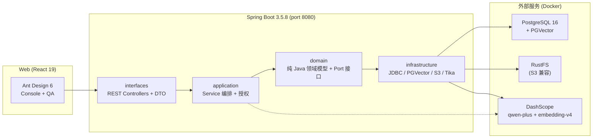

# my-AI

> AI 知识管理平台 — 上传文档，自动解析、分块、向量化，通过 RAG 实现基于私有知识的智能问答。

<p align="center">
  
  
  
  
  
  
</p>

---

## 架构总览



**架构模式**：DDD-Lite（六边形架构简化版）。领域层是系统心脏，零框架依赖；基础设施层通过 Port 接口插入。

## 核心能力

| 能力 | 说明 |
|---|---|
| 📄 **文档入库** | 上传 PDF / Word / HTML / Markdown，自动解析清洗 |
| ✂️ **智能分块** | Markdown 结构优先分段（标题感知）+ 滑动窗口兜底 |
| 🔢 **向量索引** | PGVector HNSW 索引，1024 维，余弦距离 |
| 🤖 **RAG 问答** | 语义检索 → DashScope LLM 生成 → 引用分块溯源 |
| 🔐 **三级授权** | 工作区级 → 知识库级 → 文档级，逐级收敛 |
| 📋 **审计追踪** | append-only 审计日志，独立事务 |
| 🔄 **版本管理** | 文档多版本链，支持回退和重处理 |

## 快速开始

### 前置条件

- JDK 21 · Docker · DashScope API Key（[百炼平台](https://bailian.console.aliyun.com/)申请）

### 三步跑起来

```bash
# 1. 启动基础设施（PostgreSQL + RustFS + Docling Serve）
cd infra && docker compose up -d
# 首次启动 Docling Serve 会自动下载模型，通常在 5 分钟内完成
# 用 docker compose ps 确认 docling-serve 进入 healthy 状态后再继续

# 2. 启动后端（Flyway 自动建表）
export DASHSCOPE_API_KEY="sk-xxx"
./mvnw spring-boot:run                     # → localhost:8080

# 3. 启动前端（可选）
cd web && npm ci && npm run dev            # → localhost:55555
```

> 首次启动时配置 `MYAI_AUTH_BOOTSTRAP_ADMIN_USERNAME` / `MYAI_AUTH_BOOTSTRAP_ADMIN_PASSWORD` 可自动创建管理员账号。完整环境变量清单见 [开发指南](./docs/guides/development.md)。

### 运行测试

```bash
./mvnw test                                 # 纯单测（无外部依赖）
./mvnw verify                               # 含集成测试（需 PostgreSQL）
cd web && npm run test:e2e                  # Playwright E2E（需前后端运行）
```

## 子域地图

```
用户上传文件
  → [ingest] 受理 + Tika 解析 → 结构分块 → PGVector 向量化
  → [knowledge] 知识库聚合已索引文档
  → [qa] 语义检索 + LLM 生成 → 答案 + 引用溯源
```

| 子域 | API 前缀 | 端点数 | 职责 |
|---|---|---|---|
| **auth** | `/api/v1/auth` · `/api/v1/admin/*` | 22 | 认证、授权、治理、审计 |
| **ingest** | `/api/v1/documents` | 10 | 文档入库生命周期 |
| **knowledge** | `/api/v1/knowledge-bases` | 4 | 知识库主数据管理 |
| **qa** | `/api/v1/qa` | 1 | RAG 检索 + 回答生成 |

## 技术栈

### 后端

| 组件 | 版本 | 用途 |
|---|---|---|
| Java | 21 (LTS) | 运行时 |
| Spring Boot | 3.5.8 | Web 框架 |
| Spring AI | 1.1.2 | AI 集成核心 |
| Spring AI Alibaba | 1.1.2.x | DashScope 适配 + Agent Framework |
| PostgreSQL + PGVector | 16 | 关系数据 + HNSW 向量索引 |
| Flyway | — | 数据库版本迁移 |
| Apache Tika | 2.9.2 | 文档解析 |
| AWS SDK v2 | 2.42.14 | S3 兼容对象存储 |
| jsoup + flexmark | 1.18.3 / 0.64.8 | HTML 清洗 + Markdown 渲染 |

### 前端

| 组件 | 版本 | 用途 |
|---|---|---|
| React | 19.2.4 | UI 框架 |
| TypeScript | 6.0 | 类型系统（Zod-first） |
| Ant Design | 6.3.5 | 组件库 |
| TanStack React Query | 5.96.2 | 服务端状态 + 缓存 |
| React Router | 7.14.0 | 嵌套路由 + 懒加载 |
| Vite | 8.0.4 | 构建工具 |
| Playwright | 1.56.1 | E2E 测试 |

## 文档导航

| 文档 | 说明 |
|---|---|
| [架构设计](./docs/architecture/overview.md) | DDD-Lite 分层、四子域详解、技术选型 |
| [API 契约](./docs/api/contracts.md) | 37 个 `/api/v1` REST API 端点清单 |
| [数据模型](./docs/data/models.md) | 12 张表结构 + Flyway 迁移历史 |
| [ADR 索引](./docs/adr/index.md) | 7 篇架构决策记录 + 决策演化图 |
| [开发指南](./docs/guides/development.md) | 环境变量、启动、构建、测试 |
| [源码结构](./docs/guides/source-tree.md) | 目录树 + 关键文件注释 |
| [BACKLOG](./docs/backlog/BACKLOG.md) | 待改进项（P0-P2，25 项） |
| [AI 编码规则](./docs/project-context.md) | AI Agent 必须遵守的 162 条规则 |
| [UI 设计规范](./DESIGN.md) | 颜色/间距/字体 Token |

## 项目结构

```
my-AI/
├── src/main/java/io/github/spike/myai/
│   ├── auth/          # 认证授权子域
│   ├── ingest/        # 文档入库子域
│   ├── knowledge/     # 知识库子域
│   ├── qa/            # RAG 问答子域
│   └── shared/        # 共享工具
├── src/main/resources/db/migration/   # Flyway 迁移脚本
├── web/               # React 前端
├── infra/             # Docker Compose（PGVector + RustFS + Docling Serve）
├── docs/              # 项目文档
└── _bmad-output/      # BMad 工作流产物
```

## 设计理念

- **Domain First**：领域层零框架注解，纯 Java record，依赖只指向 `java.*`
- **Port-Adapter**：基础设施实现 Port 接口插入，Controller 不碰 JdbcTemplate
- **可测试性**：Clock 注入、纯单测不启动 Spring、E2E 覆盖核心路径
- **AI Coding**：162 条编码规则约束 AI Agent，保证架构不被腐蚀

## 贡献

欢迎提交 Issue 和 PR。贡献前请阅读 [开发指南](./docs/guides/development.md)，提交代码前确保通过 `./mvnw verify` 和 `npm run build`。

---

_Built by spike · Powered by Spring AI + DashScope_
