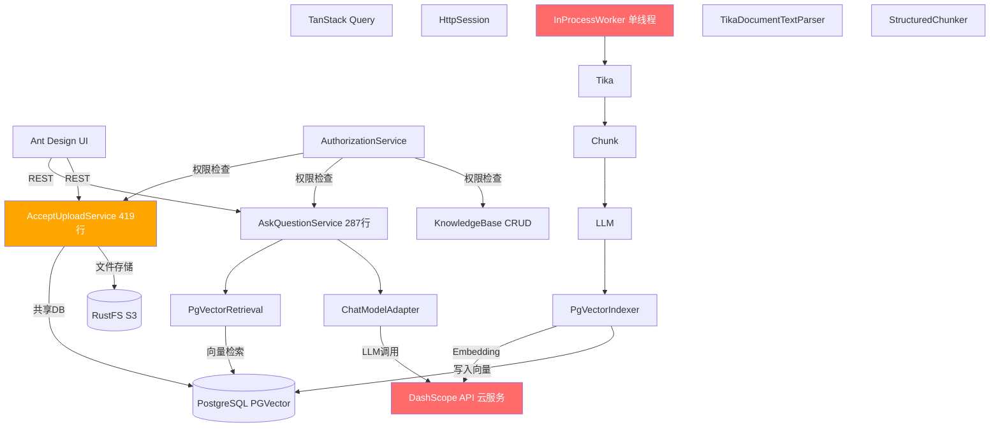
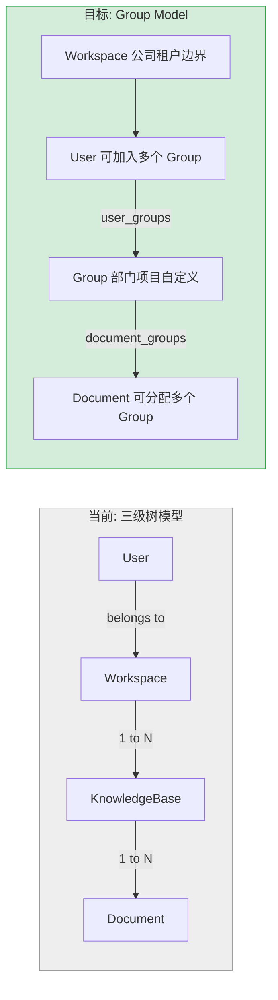
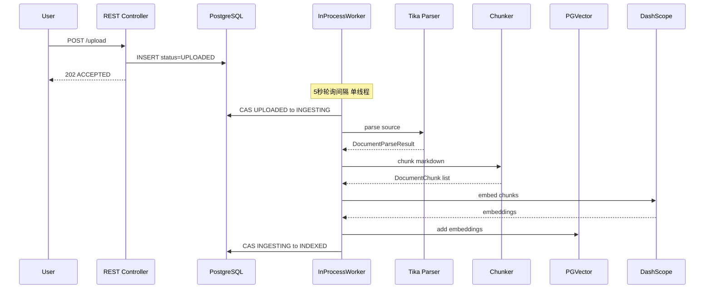

# Research Report: my-AI 全模块技术架构深度评估

**Date:** 2026-06-04
**Author:** spike
**Research Type:** technical

---

## Executive Summary

本报告以创新策略文档（2026-06-04）定义的新定位——**"面向企业内部文档的私有化 AI 阅读助手"**——为基准，对项目 4 个 Bounded Context、~15,000 行 Java、~5,000 行 TypeScript 进行了全量代码审查 + 外部最佳实践验证，覆盖 10 个技术维度。

### 三个系统性差距

| # | 差距                       | 当前状态                                                                                 | 目标状态                                               | 修复成本       |
| - | -------------------------- | ---------------------------------------------------------------------------------------- | ------------------------------------------------------ | -------------- |
| 1 | **私有化部署不成立** | LLM 用 DashScope（阿里云），数据每次调用出网；应用无 Docker 容器化                       | Ollama 本地模型 + docker-compose 一键部署              | ~5 天          |
| 2 | **并发处理不存在**   | `@Scheduled` 单线程轮询，`worker.enabled` 默认 `false`；30 份文档需排队 15-30 分钟 | Virtual Threads + @Async 并发处理                      | **1 天** |
| 3 | **权限模型待重建**   | 三级树结构（Workspace→KB→Document），一人一 Workspace                                  | Group Model（多群组 + Highest Wins + 零 Group 草稿区） | ~12 天         |

### 架构质量评价

核心技术骨架（Hexagonal 架构分层、DDD 聚合根状态机、CAS 乐观锁、端口-适配器模式）是**教科书级别的实现**。Java 21 / Spring Boot 3.5.8 / PostgreSQL 16 + PGVector / React 19 的技术选型无需替换。

问题集中在"私有化部署"这个核心定位所需的配套基础设施——这部分当前几乎为零。

### 审查指引

| 审查目标     | 重点阅读章节                               | 预计时间        |
| ------------ | ------------------------------------------ | --------------- |
| 快速了解结论 | Executive Summary + 10-Dimension Scorecard | 5 分钟          |
| 评估技术风险 | Critical Findings + Risk Matrix            | 15 分钟         |
| 评估工作量   | 3-Phase Action Roadmap                     | 10 分钟         |
| 深入某个维度 | 对应维度详细分析 (§1-§10)                | 每章 10-15 分钟 |
| 全部审查     | 全文                                       | ~60 分钟        |

---

## 10-Dimension Assessment Scorecard

> 评分标准: ★★★★★ = 生产就绪 · ★★★★☆ = 基本合格 · ★★★☆☆ = 有显著差距 · ★★☆☆☆ = 严重不足 · ★☆☆☆☆ = 缺失

| #  | 维度             | 当前       | 目标       | 差距等级       | 关键行动                   | 修复成本        |
| -- | ---------------- | ---------- | ---------- | -------------- | -------------------------- | --------------- |
| 1  | 架构与模块分析   | ★★★★☆ | ★★★★★ | 中             | Group Model 迁移           | Phase 1 (12天)  |
| 2  | 实现方案审查     | ★★★☆☆ | ★★★★☆ | **高**   | 并发修复 + Controller 拆分 | Phase 1 (3天)   |
| 3  | 技术栈适配       | ★★★★☆ | ★★★★★ | **严重** | DashScope→Ollama          | Phase 3 (5天)   |
| 4  | 集成模式         | ★★★☆☆ | ★★★★☆ | **高**   | 容错/重试/输入校验         | Phase 1 (1.5天) |
| 5  | 数据安全与隔离性 | ★★★☆☆ | ★★★★★ | **高**   | 权限真隔离验证 + 防泄漏    | Phase 1-2       |
| 6  | 可观测性与运维   | ★★☆☆☆ | ★★★★☆ | **高**   | 结构化日志/Trace ID/指标   | Phase 3 (2天)   |
| 7  | 部署与交付       | ★☆☆☆☆ | ★★★★★ | **严重** | 应用容器化 + 一键部署      | Phase 3 (2天)   |
| 8  | 文档生命周期     | ★★★☆☆ | ★★★★☆ | 中             | 脏向量清理 + 版本一致性    | Phase 2 (1天)   |
| 9  | 模型替换风险     | ★★★☆☆ | ★★★★☆ | 中             | Ollama 迁移 + 评估体系     | Phase 2-3       |
| 10 | 性能考量         | ★★★☆☆ | ★★★★☆ | **高**   | Hybrid Search + 并发处理   | Phase 1-2       |

**汇总**: 2 项严重 · 6 项高优先级 · 7 项中优先级 · 0 项低优先级

---

## Table of Contents

1. [Architecture at a Glance](#architecture-at-a-glance) — 架构全景图 + 权限模型对比图 + 数据流图
2. [Critical Findings by Severity](#critical-findings-by-severity) — 按严重程度排序的关键发现
3. [§1 技术栈适配](#1-technology-stack-analysis) — 技术选型评估 + 外部验证
4. [§2 集成模式](#2-integration-patterns) — 模块间集成 + 外部服务 + 数据流
5. [§3 架构与模块分析](#3-architecture-and-module-analysis) — Hexagonal 架构评估 + Group Model 迁移影响
6. [§4 实现方案深度审查](#4-implementation-review) — 逐模块代码审查 (ingest/qa/auth/knowledge)
7. [§5 数据安全与隔离性](#5-data-security-and-isolation) — 权限真隔离 + 嵌入空间泄漏 + 元数据安全
8. [§6 可观测性与运维成熟度](#6-observability-and-operations) — 日志/指标/健康检查/审计
9. [§7 部署与交付模式](#7-deployment-and-delivery) — Docker/K8s/冷启动/依赖编排
10. [§8 文档生命周期管理](#8-document-lifecycle) — 脏向量/版本一致性/清理策略
11. [§9 模型替换与厂商锁定](#9-model-lock-in-risk) — Ollama 耦合度/迁移成本/切换策略
12. [§10 性能考量](#10-performance) — 检索性能/文档吞吐/多用户并发
13. [Risk Matrix](#risk-matrix) — 综合风险矩阵 (概率 × 影响)
14. [3-Phase Action Roadmap](#3-phase-action-roadmap) — 三阶段执行路线图
15. [Success Metrics](#success-metrics) — 关键成功指标
16. [Sources](#sources) — 内外部引用来源

---

## Architecture at a Glance

### 当前系统全景



### Group Model 迁移: 权限模型对比



### 文档处理数据流



---

## Critical Findings by Severity

> 以下是从全部 10 个维度中提取的关键发现，按严重程度排序。每条标注了对应的详细分析章节。

### 严重 (CRITICAL) — 阻塞私有化部署定位

| #            | 发现                                                                                                                                                             | 影响           | 详细分析                                                                     |
| ------------ | ---------------------------------------------------------------------------------------------------------------------------------------------------------------- | -------------- | ---------------------------------------------------------------------------- |
| **C1** | **LLM 提供商是 DashScope (阿里云)，不是 Ollama** — 每次 LLM/Embedding 调用数据出网，直接违反"私有化部署、数据不出企业内网"的核心定位。Ollama 集成代码为零 | 产品定位不成立 | [§1 技术栈](#1-technology-stack-analysis) / [§9 模型替换](#9-model-lock-in-risk) |
| **C2** | **应用零容器化** — 无 Dockerfile，docker-compose 只有 PG+RustFS。"面试官 clone 5 分钟跑通"的目标无法实现                                                  | 无法交付       | [§7 部署与交付](#7-deployment-and-delivery)                                    |

### 高优先级 (HIGH) — 多人公司场景下不可用

| #            | 发现                                                                                                                                                          | 影响               | 详细分析                                                          |
| ------------ | ------------------------------------------------------------------------------------------------------------------------------------------------------------- | ------------------ | ----------------------------------------------------------------- |
| **H1** | **文档处理单线程串行** — `@Scheduled` 默认单线程，`worker.enabled` 默认 `false`。30 份文档需排队 15-30 分钟                                      | 多人上传场景不可用 | [§4 实现方案](#4-implementation-review) / [§10 性能](#10-performance) |
| **H2** | **外部 API 调用零容错** — DashScope 的 LLM/Embedding 调用无超时、重试、熔断。一次网络抖动直接导致问答失败                                              | 系统不稳定         | [§2 集成模式](#2-integration-patterns)                              |
| **H3** | **权限模型需完整重建** — Group Model 替换三级树，涉及 3 个 Bounded Context、3 个新表、2 个核心 SQL 重写                                                | 架构核心变更       | [§3 架构](#3-architecture-and-module-analysis)                      |
| **H4** | **无 RAG 效果量化评估** — 不知道当前检索命中率是多少。对照 EMNLP 2024 论文缺 Hybrid Search + Reranking + Query Classification + Summarization 四个模块 | RAG 效果未知       | [§4 实现方案](#4-implementation-review)                             |
| **H5** | **无权限过滤正确性测试** — 没有自动化测试验证"不同用户对同一问题拿到不同结果"。这是安全关键路径                                                        | 合规红线           | [§5 数据安全](#5-data-security-and-isolation)                       |
| **H6** | **可观测性严重不足** — 无结构化日志、无 Trace ID、无关键指标暴露、无告警。客户自己运维时无法定位问题                                                   | 无法交付企业客户   | [§6 可观测性](#6-observability-and-operations)                      |

### 中优先级 (MEDIUM) — 技术债务累积

| #  | 发现                                                                       | 影响                    | 详细分析                               |
| -- | -------------------------------------------------------------------------- | ----------------------- | -------------------------------------- |
| M1 | DocumentIngestController 796 行 (臃肿)                                     | 可维护性                | [§4 实现方案](#4-implementation-review)  |
| M2 | AcceptUploadApplicationService 419 行 (职责过重)                           | 可测试性                | [§4 实现方案](#4-implementation-review)  |
| M3 | `AuthorizationService` 跨 Bounded Context 直接依赖 (破坏 Hexagonal 边界) | 架构内聚性              | [§2 集成模式](#2-integration-patterns)   |
| M4 | 无 Bean Validation 输入校验 + 无 API 文档                                  | 数据安全 + 开发效率     | [§2 集成模式](#2-integration-patterns)   |
| M5 | Embedding 维度硬编码 (1024)，切换模型需全量重建                            | 迁移成本                | [§9 模型替换](#9-model-lock-in-risk)     |
| M6 | 脏向量残留 — 已删除/旧版本文档的向量不会被自动清除                        | 存储浪费 + 潜在检索污染 | [§8 文档生命周期](#8-document-lifecycle) |
| M7 | 缺少 ArchUnit 架构测试                                                     | 架构退化风险            | [§4 实现方案](#4-implementation-review)  |

---

## §1 Technology Stack Analysis

> **方法论**: 先通过代码审查摸清当前技术栈的实际情况（非文档声明），再对关键选型决策做外部验证，识别与创新策略目标架构的差距。

### 当前技术栈全景

```
Java 21 / Maven 3.9.14
Spring Boot 3.5.8 / Spring AI 1.1.2 / Spring AI Alibaba 1.1.2.0
PostgreSQL 16 + PGVector (HNSW, cosine, 1024-dim)
DashScope (qwen-plus chat / text-embedding-v4 embeddings)
Apache Tika 2.9.2 + Jsoup 1.18.3 + Flexmark 0.64.8
AWS SDK 2.42.14 (S3-compatible storage via RustFS)
Flyway (8 migrations)
React 19 / TypeScript 6 / Vite 8 / Ant Design 6 / TanStack Query 5 / Zod 4
Playwright 1.56 (E2E tests)
```

### 1. 编程语言与运行时

**当前**: Java 21，单模块 Maven 项目，未使用 Virtual Threads。

**评估**: Java 21 是正确选择。Virtual Threads（Project Loom）在 21 正式 GA，对 I/O 密集型场景（文档解析、LLM 调用、向量检索）有显著吞吐提升。**当前未启用**。

**差距**: 异步处理用 `@Scheduled` 轮询 + 平台线程，未利用 Virtual Threads。在多人并发上传场景下，每个文档解析可能阻塞平台线程数秒到数十秒。

**来源**: [Spring Boot 3.x Virtual Threads support](https://docs.spring.io/spring-boot/reference/features/virtual-threads.html)

---

### 2. 应用框架 — Spring Boot 3.5.8 + Spring AI 1.1.2

**当前**: Spring Boot 3.5.8（2026年最新稳定版），Spring AI 1.1.2 提供 `ChatModel` / `EmbeddingModel` / `VectorStore` 三大抽象。

**评估**:

- **Spring Boot 版本**: 3.5.8 是当前最新，无升级压力
- **Spring AI 抽象层**: 设计良好，`VectorStore` 接口统一了 PGVector 的操作，`ChatModel` 统一了 LLM 调用。理论上切换 LLM 提供商只需换 starter
- **Spring AI Alibaba**: 当前唯一的 LLM 实现是 DashScope starter。这带来一个关键发现：

**关键发现: 当前代码使用 DashScope（阿里云通义千问），而非创新策略中规划的 Ollama**

这意味着：

- 当前**依赖外部云服务**，不符合"私有化部署、数据不出企业内网"的核心定位
- 没有配置 `spring-ai-ollama-starter`，Ollama 集成代码为零
- Spring AI 的抽象层让切换成为可能，但**从未验证过**切换到 Ollama 后的行为差异（embedding 维度、prompt 模板、token 限制）

**来源**: 代码审查 (`application.yaml`, `ChatModelAnswerGenerationAdapter.java`, `PgVectorDocumentVectorIndexer.java`)；[Spring AI Vector Store docs](https://deepwiki.com/spring-projects/spring-ai/4-vector-store-integrations)

---

### 3. 向量数据库 — PGVector HNSW

**当前配置**:

```yaml
spring.ai.vectorstore.pgvector:
  index-type: HNSW
  distance-type: COSINE_DISTANCE
  dimensions: 1024
  batching-max-size: 10000
```

**外部验证 — 2025/2026 生产最佳实践**:

| 数据规模        | PGVector HNSW 适用性  | 延迟       |
| --------------- | --------------------- | ---------- |
| <1M vectors     | 优秀，零额外基础设施  | ~5-15ms    |
| 1M-10M vectors  | 需调优，足够内存      | ~20-40ms   |
| 10M-50M vectors | 需要 64GB+ RAM        | 可能退化   |
| >50M vectors    | **不推荐** HNSW | 数秒级延迟 |

pgvector 0.8 (2025.3) 带来:

- HNSW 构建速度 +40%
- `halfvec` 类型（存储减半）
- SIMD 加速距离计算 20-30%

**当前项目评估**:

- 企业内网场景，单一公司的文档量级在万到十万级别，PGVector 完全够用
- **缺失**: 未配置 GIN 索引用于 metadata 过滤（`metadata->>'documentId'`），这是创新策略中已识别的待办项
- **缺失**: HNSW 参数使用默认值（`m=16, ef_construction=64`），未针对 1024 维做调优

**风险**: PGVector 的查询计划器不理解向量相似度的代价模型，可能在权限过滤 + 向量检索混合查询时选择错误的执行顺序（先向量搜索再权限过滤 vs 先权限过滤再向量搜索）

**来源**: [pgvector 0.8 release notes](https://www.jusdb.com/blog/pgvector-08-new-features-postgresql-vector-search); [Mastra pgvector benchmarks](https://mastra.ai/blog/pgvector-perf); [PGVector production bottleneck analysis](https://blog.hotdry.top/posts/2025/11/04/pgvector-performance-bottleneck-production-analysis/)

---

### 4. AI/LLM 提供商 — DashScope vs Ollama

**当前**: 完全依赖 DashScope（阿里云通义千问）

- Chat: `qwen-plus`
- Embedding: `text-embedding-v4` (1024-dim)

**目标（创新策略 Phase 3）**: Ollama 本地模型，零外部依赖

**差距矩阵**:

| 维度           | 当前 (DashScope)   | 目标 (Ollama)            | 差距               |
| -------------- | ------------------ | ------------------------ | ------------------ |
| 部署依赖       | 需要阿里云 API Key | 零外部依赖               | **大**       |
| 数据出网       | 每次调用出网       | 不出内网                 | **合规红线** |
| Embedding 维度 | 1024 (固定)        | 取决于模型 (如 768/4096) | 迁移需重建向量     |
| Chat 模型能力  | qwen-plus (强)     | 取决于本地模型           | **需评估**   |
| Spring AI 适配 | DashScope starter  | Ollama starter           | starter 替换即可   |

**关键风险**: embedding 维度变化会导致**全量向量重建**——需规划迁移窗口和回退策略。

**来源**: [Spring AI Alibaba DashScope](https://developer.aliyun.com/article/1724412)

---

### 5. 文档解析 — Apache Tika 2.9.2

**当前**: Tika 2.9.2 + Jsoup 清洗 + Flexmark HTML→MD 转换。三条解析路由（Native Markdown / Native HTML / Tika 通用）。

**评估**:

- Tika 覆盖面广（PDF, Word, Excel, PPT, HTML 等），但**解析质量依赖文件本身结构**
- 复杂 PDF（多栏、表格、扫描件）的解析效果一般，这是 ADR-0008 引入 Docling 的动机
- `tika-parsers-standard-package` 体积大，启动慢（首次加载 Parser 类）

**Docling (ADR-0008)**: IBM 开源的文档解析器，专注复杂 PDF 的结构化提取（表格、公式、阅读顺序），对学术/技术文档表现优于 Tika。但在 Phase 2 才引入，Phase 1 继续用 Tika 是合理的解耦策略。

**来源**: [ADR-0008-docling-complex-document-parser-adapter.md](D:\Code\project\my-AI\docs\adr\)

---

### 6. 认证与安全 — Session-Based (Spring Security)

**当前**:

- HttpSession 存储认证状态
- 自定义 CSRF Header (`X-MYAI-CSRF: 1`)
- BCrypt 密码编码
- 无 JWT，无 OAuth2

**外部验证 — Session vs JWT 在企业内部部署的对比**:

| 维度       | Session (当前)          | JWT                     |
| ---------- | ----------------------- | ----------------------- |
| 水平扩展   | 需要 Redis 共享 Session | 天然无状态              |
| 前端复杂度 | 零（Cookie 自动携带）   | 需管理 Token 存储和刷新 |
| 安全性     | Cookie HttpOnly+Secure  | Payload 可解码          |
| 多端支持   | 受限                    | 天然支持                |
| 单点登录   | 困难                    | 标准化                  |

**评估**: 对于当前 MVP 阶段，Session-based 认证是合理的简单选择。但创新策略的目标是私有化部署给企业客户，企业客户的典型需求是：

- **多实例部署**（高可用）→ Session 共享成为必须
- **SSO 集成**（对接企业 LDAP/AD）→ Session 方案不友好

**差距**: 当前没有 JWT/OAuth2 的任何基础设施，如果企业客户要求 SSO，改动量较大。

**来源**: [Spring Security Session vs JWT 对比分析](https://blog.csdn.net/CodeJavaPro/article/details/149855073)

---

### 7. 前端技术栈

**当前**: React 19.2.4 + TypeScript 6.0.2 + Vite 8.0.4 + Ant Design 6.3.5 + TanStack Query 5.96.2 + Zod 4.3.6

**评估**: 全部是 2026 年最新主版本，技术选型优秀。TanStack Query 的服务端状态管理 + Zod 的运行时校验是现代最佳实践。无重大问题。

---

### 8. 基础设施与部署

**当前**:

- `infra/docker-compose.yml`：仅 postgres + rustfs，**不包括应用本身**
- **无** Dockerfile 用于应用容器化
- **无** Kubernetes 配置
- **无** nginx/SSL 终止

**差距**: 这是 Phase 3 的核心工作。当前开发模式是 `mvnw spring-boot:run` + `npm run dev`，离"面试官 clone 5 分钟跑通"的目标差距很大。

---

### 技术栈差距总结

| # | 组件               | 当前状态         | 目标状态                           | 差距等级       |
| - | ------------------ | ---------------- | ---------------------------------- | -------------- |
| 1 | LLM 提供商         | DashScope (云)   | Ollama (本地)                      | **严重** |
| 2 | 应用容器化         | 无               | Dockerfile + docker-compose 全服务 | **严重** |
| 3 | 异步处理           | @Scheduled 轮询  | 消息队列 / Virtual Threads         | **高**   |
| 4 | 认证扩展性         | Session (单实例) | Session+Redis 或 JWT               | **中**   |
| 5 | 向量 metadata 索引 | 无 GIN 索引      | GIN 索引 + ANY(array) 过滤         | **中**   |
| 6 | 文档解析           | Tika 2.9.2       | Tika + Docling (Phase 2)           | **中**   |
| 7 | HNSW 参数调优      | 默认值           | 生产调优                           | **低**   |
| 8 | 前端               | 现代且完整       | 保持                               | **无**   |
| 9 | Java/Boot 版本     | 最新             | 保持                               | **无**   |

---

### 外部引用

- [Spring AI Vector Store Integrations — DeepWiki](https://deepwiki.com/spring-projects/spring-ai/4-vector-store-integrations)
- [pgvector 0.8 Release Notes — JusDB (2025.3)](https://www.jusdb.com/blog/pgvector-08-new-features-postgresql-vector-search)
- [PGVector Production Bottleneck Analysis (2025)](https://blog.hotdry.top/posts/2025/11/04/pgvector-performance-bottleneck-production-analysis/)
- [Mastra pgvector RAG Performance Benchmarks](https://mastra.ai/blog/pgvector-perf)
- [Spring Boot + Spring Security Session vs JWT](https://blog.csdn.net/CodeJavaPro/article/details/149855073)
- [Spring AI Alibaba DashScope Starter](https://developer.aliyun.com/article/1724412)
- [Google Cloud ScaNN for AlloyDB vs pgvector HNSW (2025.3)](https://cloud.google.com/blog/products/databases/how-scann-for-alloydb-vector-search-compares-to-pgvector-hnsw)

---

## §2 Integration Patterns Analysis

> **方法论**: 基于代码审查，分析 4 个 Bounded Context 间的集成方式、外部服务集成、数据流模式，并与行业最佳实践对照。

### 1. 模块间集成 — Hexagonal + 共享数据库

**当前架构**:

```
┌──────────┐    ┌──────────┐    ┌──────────┐    ┌──────────┐
│   auth   │    │  ingest  │    │knowledge │    │    qa    │
│          │    │          │    │          │    │          │
│ 认证授权  │◄───│ 权限检查  │    │ 权限检查  │◄───│ 权限检查  │
│          │    │          │    │          │    │          │
└────┬─────┘    └────┬─────┘    └────┬─────┘    └────┬─────┘
     │               │               │               │
     └───────────────┴───────────────┴───────────────┘
                         │
               PostgreSQL (共享数据库)
```

**集成方式**: 所有模块共享同一个 PostgreSQL 数据库，通过 Spring 依赖注入直接调用其他模块的 Application Service。

**关键集成点**:

| 调用方    | 被调用方  | 集成方式                            | 接口                                    |
| --------- | --------- | ----------------------------------- | --------------------------------------- |
| ingest    | auth      | DI 注入 `AuthorizationService`    | `requireCanContributeKnowledgeBase()` |
| ingest    | auth      | DI 注入 `CurrentUserProvider`     | `requireCurrentUser()`                |
| qa        | auth      | DI 注入 `AuthorizationService`    | `requireCanAskKnowledgeBase()`        |
| qa        | auth      | DI 注入 `CurrentUserProvider`     | `requireCurrentUser()`                |
| knowledge | auth      | DI 注入 `AuthorizationService`    | KB CRUD 权限检查                        |
| ingest    | knowledge | DI 注入 `KnowledgeBaseRepository` | `findByKbId()` 验证 KB 有效性         |
| qa        | knowledge | DI 注入 `KnowledgeBaseRepository` | `findByKbId()` 验证 KB 有效性         |

**评估**: 这种集成方式在单体应用中是正确的。共享数据库 + DI 直接调用是 Hexagonal 架构在单模块项目中的自然形态，避免了不必要的 HTTP 调用开销。

**但有一个结构性问题**: `AuthorizationService` 在 `auth` 包中定义，被 `ingest`、`qa`、`knowledge` 三个包直接依赖。按照 Hexagonal 的依赖方向，跨 Bounded Context 的调用应该走 `application` 层的端口接口，而不是直接依赖具体实现类。当前 `AuthorizationService` 是一个具体类而非接口，各模块直接注入使用——这破坏了 Bounded Context 的独立性。

**来源**: 代码审查；[Spring Boot Hexagonal Architecture Best Practices 2025](https://blog.stackademic.com/clean-scalable-spring-boot-microservices-with-hexagonal-architecture-2025-guide-folder-4afd01d3130b)

---

### 2. 外部服务集成

**当前外部依赖**:

```
my-AI Application
    │
    ├── DashScope API (阿里云)
    │   ├── Chat: qwen-plus (回答问题)
    │   └── Embedding: text-embedding-v4 (向量化)
    │   协议: HTTPS REST
    │   客户端: Spring AI ChatModel / EmbeddingModel
    │   重试: 无显式配置
    │   超时: 无显式配置
    │   熔断: 无
    │
    ├── PostgreSQL 16 + PGVector
    │   协议: PostgreSQL Wire Protocol (JDBC)
    │   客户端: HikariCP 连接池 + Spring JdbcTemplate
    │   重试: HikariCP 连接重试
    │
    └── S3-compatible (RustFS / AWS S3)
        协议: HTTPS S3 API
        客户端: AWS SDK 2.42.14
        用途: 文档源文件 + 处理产物存储
        重试: AWS SDK 默认重试 (3次)
        熔断: 无
```

**差距分析**:

| 关注点             | 当前状态          | 问题                 | 建议                          |
| ------------------ | ----------------- | -------------------- | ----------------------------- |
| DashScope 不可用   | 无降级策略        | 问答直接失败         | 至少加超时配置 + 友好错误提示 |
| DashScope 速率限制 | 无处理            | 批量上传可能触发限流 | 指数退避重试 + 速率控制       |
| PG 连接池耗尽      | HikariCP 默认配置 | 高并发下连接等待     | 根据并发量调优 pool size      |
| S3 不可用          | AWS SDK 默认重试  | 上传失败无友好提示   | 明确的重试策略 + 失败状态管理 |

**关键发现**: 当前 `RetryPolicy` 类（43行）只用于文档处理的异常分类（transient vs fatal），**没有应用于外部 API 调用**。LLM 调用 (`ChatModel.call()`) 和 Embedding 调用 (`VectorStore.add()`) 完全没有重试或熔断保护。

**外部 API 容错现状**:

| 调用                | 超时        | 重试            | 熔断 | 降级 |
| ------------------- | ----------- | --------------- | ---- | ---- |
| DashScope Chat      | ❌          | ❌              | ❌   | ❌   |
| DashScope Embedding | ❌          | ❌              | ❌   | ❌   |
| PostgreSQL          | ✅ HikariCP | ✅ HikariCP     | ❌   | ❌   |
| S3                  | ✅ SDK 默认 | ✅ SDK 默认 (3) | ❌   | ❌   |

**最低修复**: Spring AI 1.1.2 支持 Recursive Advisors 配置重试，加上 Resilience4j `@CircuitBreaker` 即可实现熔断。

**来源**: 代码审查 (`ChatModelAnswerGenerationAdapter.java:29`, `PgVectorDocumentVectorIndexer.java:195`, `RetryPolicy.java:43`)；[Spring AI Resilience Patterns](https://www.javacodegeeks.com/a-guide-to-using-recursive-advisors-in-spring-ai.html)；[Spring AI Recursive Advisors Guide](https://www.javacodegeeks.com/a-guide-to-using-recursive-advisors-in-spring-ai.html)

---

### 3. API 设计 — REST Controllers

**当前 REST API 设计**:

| 设计维度   | 当前实现                                | 评估                                   |
| ---------- | --------------------------------------- | -------------------------------------- |
| URL 版本化 | `/api/v1/` 前缀                       | 正确                                   |
| HTTP 方法  | GET/POST/PATCH/DELETE 语义正确          | 正确                                   |
| 请求体     | JSON (Spring MVC 自动反序列化)          | 正确                                   |
| 响应体     | 统一 JSON 结构 (Result DTO)             | 正确                                   |
| 错误响应   | `GlobalRestExceptionHandler` 统一处理 | 良好                                   |
| 输入校验   | 基本 (@RequestParam 必填检查)           | **不足** — 缺少 Bean Validation |
| 分页       | 部分端点有 (`DocumentListPage`)       | **不一致** — 部分端点缺少       |
| 幂等性     | 上传去重 (file hash)，其他操作无保证    | **不足**                         |
| API 文档   | 无 OpenAPI/Swagger                      | **缺失**                         |
| CORS       | 未显式配置                              | **可能有问题** — 前后端分离需要 |

**关键关注点**:

1. **无输入校验**: `AcceptUploadCommand` 和 `AskQuestionCommand` 没有 `@Valid` / `@NotBlank` 等 Bean Validation 注解。恶意或异常输入直接穿透到服务层。
2. **无幂等性保证**: 除了上传有 file hash 去重，创建 KB、修改权限等写操作没有幂等键。网络重试可能产生重复操作。
3. **无 API 文档**: 没有 OpenAPI/Swagger 集成。前端对接依赖人工沟通。

**来源**: 代码审查（`DocumentIngestController.java:796`, `QaController.java:162`, `GlobalRestExceptionHandler.java:115`）

---

### 4. 数据流模式 — @Scheduled Polling

**当前文档处理流程**:

```
POST /api/v1/documents/upload (同步)
    │
    ▼
ACCEPTED (状态写入 DB)
    │
    │  ← ⚠️ 轮询间隔: 5秒 (可配置)
    │
    ▼
InProcessWorker.pollAndClaim() (@Scheduled)
    │
    ▼
CAS: UPLOADED → INGESTING
    │
    ▼
解析 → 分块 → 向量化 → 存储 (同步执行)
    │
    ▼
INDEXED / FAILED
```

**问题分析**:

| 问题           | 说明                           | 影响                                              |
| -------------- | ------------------------------ | ------------------------------------------------- |
| 单进程串行     | `@Scheduled` 默认单线程执行  | 多个文档需排队，第 N 个文档等 (N-1)×平均处理时间 |
| 无并行能力     | 即使有多核 CPU，也只用一个线程 | 资源利用率低                                      |
| 轮询延迟       | 固定 5 秒间隔                  | 上传后最多等 5 秒才开始处理                       |
| 无处理状态推送 | 前端只能轮询 `GET /status`   | 用户体验差                                        |
| 无持久化队列   | 进程重启丢失处理中状态         | 文档卡在 INGESTING 状态                           |
| 无横向扩展     | 多实例会竞争同一个文档         | 需要 CAS 乐观锁来避免重复处理                     |

**CAS 乐观锁是正确的**: `ClaimNextUploadedDocumentApplicationService` 使用 `UPDATE ... WHERE status = 'UPLOADED' SET status = 'INGESTING'` 的 CAS 模式，多实例场景下不会重复处理。但这是唯一的并发安全措施。

**行业对比**:

| 方案                      | 适用场景         | 复杂度          |
| ------------------------- | ---------------- | --------------- |
| @Scheduled 轮询 (当前)    | 单用户、低吞吐   | 最低            |
| `@Async` + ThreadPool   | 单实例、中吞吐   | 低              |
| Virtual Threads (Java 21) | 单实例、I/O 密集 | 低 (改配置即可) |
| 消息队列 (RabbitMQ/Kafka) | 多实例、高吞吐   | 高              |
| Spring Cloud Stream       | 多实例、事件驱动 | 中              |

**建议**: Phase 1 至少启用 `@Async` + 合理线程池，或启用 Virtual Threads。Phase 2/3 再考虑消息队列。

**来源**: 代码审查 (`InProcessWorker.java:55`, `ProcessDocumentApplicationService.java:270`)；[Spring Boot Virtual Threads](https://docs.spring.io/spring-boot/reference/features/virtual-threads.html)

---

### 5. 认证与安全集成

**当前安全链路**:

```
Browser
  │  POST /api/v1/auth/login
  ▼
AuthController.login()
  │  BCrypt 密码验证
  │  创建 MyAiPrincipal → SecurityContext → HttpSession
  ▼
Set-Cookie: JSESSIONID=<sid>
  │
  │  后续请求 (Cookie 自动携带)
  ▼
CsrfHeaderFilter (X-MYAI-CSRF: 1 检查)
  │
SpringSecurityCurrentUserProvider (提取 CurrentUser)
  │
AuthorizationService (三层权限检查)
```

**安全集成评估**:

| 关注点       | 当前实现                           | 评估                                      |
| ------------ | ---------------------------------- | ----------------------------------------- |
| 密码存储     | BCrypt                             | 正确                                      |
| 会话管理     | HttpSession (内存)                 | **单实例 OK，多实例不行**           |
| CSRF         | 自定义 Header (`X-MYAI-CSRF: 1`) | 有效但有改进空间 (标准 CSRF Token 更成熟) |
| 会话固定攻击 | 无防护                             | **缺失** — 登录后应刷新 Session ID |
| 会话超时     | 默认 (30分钟)                      | 未明确配置                                |
| 暴力破解防护 | 登录失败计数 + 锁定                | 良好                                      |
| 安全头       | 未检查是否配置 HSTS/CSP 等         | **缺失**                            |
| 审计日志     | `audit_events` 表 + Admin API    | 良好                                      |

**来源**: 代码审查 (`SecurityConfig.java:143`, `CsrfHeaderFilter.java:132`, `LoginApplicationService.java`)

---

### 6. 集成模式差距总结

| # | 发现                                                 | 严重等级     | 影响范围   |
| - | ---------------------------------------------------- | ------------ | ---------- |
| 1 | `AuthorizationService` 跨 Bounded Context 直接依赖 | 中           | 架构内聚性 |
| 2 | 外部 API 调用无重试/熔断/超时策略                    | **高** | 系统稳定性 |
| 3 | 无 API 输入校验 (Bean Validation)                    | 中           | 数据安全   |
| 4 | 无 OpenAPI 文档                                      | 低           | 开发效率   |
| 5 | @Scheduled 单线程串行处理                            | **高** | 上传吞吐   |
| 6 | 无 Session 固定攻击防护                              | 中           | 安全性     |
| 7 | 无幂等性保证 (除上传外)                              | 中           | 数据一致性 |
| 8 | 无 CORS 显式配置                                     | 低           | 前端集成   |

---

---

## §3 Architecture and Module Analysis

> **方法论**: 评估当前 Hexagonal + DDD-Lite 架构质量，对照创新策略 Group Model 目标架构做差距分析，并结合 2025 年权限感知 RAG 架构最佳实践。

### 1. 当前架构评估 — Hexagonal (Ports & Adapters)

**架构评分**:

| 维度            | 评分       | 说明                                                                            |
| --------------- | ---------- | ------------------------------------------------------------------------------- |
| 分层清晰度      | ★★★★☆ | 4 个 Bounded Context 均严格遵循 interfaces→application→domain→infrastructure |
| 依赖方向        | ★★★★☆ | 依赖指向正确（infrastructure→domain port），无反向依赖                         |
| 领域纯度        | ★★★★★ | Domain 层使用纯 Java record，零框架注解，零基础设施依赖                         |
| 端口设计        | ★★★★☆ | 端口接口粒度合理，关注点分离清晰                                                |
| 适配器独立性    | ★★★★★ | Parser/Storage/VectorStore 均有多种实现可替换                                   |
| 跨 Context 隔离 | ★★★☆☆ | AuthorizationService 被直接依赖，缺乏 Context Mapping                           |
| 聚合根设计      | ★★★★☆ | Document/KnowledgeBase 聚合边界合理，CAS 乐观锁保证一致性                       |
| 可测试性        | ★★★★★ | 端口-适配器分离使单元测试无需启动 Spring 容器                                   |

**设计亮点**:

1. **Document 聚合根的状态机**: `Document.java:387` 中定义了完整的状态转换 (`uploaded()` → `markIngesting()` → `markIndexed()` / `markFailed()`)，所有状态变更只能通过聚合根方法。教科书级 DDD 实现。
2. **CAS 乐观锁**: `claimNextUploadedDocument` 使用 `UPDATE ... WHERE status='UPLOADED'` 的 CAS 模式，在多实例并发下保证一个文档只被一个 Worker 处理。
3. **端口隔离**: `DocumentTextParser`、`DocumentChunker`、`DocumentVectorIndexer` 三个端口独立，Tika→Docling 只换 Parser 适配器。
4. **存储抽象**: `DocumentSourceStorage` + `DocumentProcessingArtifactStorage` 通过 LocalFile/S3 双适配器实现，可配置切换。

**来源**: 代码审查；[DDD Hexagonal Architecture Spring Boot 2025](https://deepwiki.com/xsreality/spring-modulith-with-ddd/2.2-domain-driven-design)

---

### 2. Group Model 迁移 — 架构影响分析

**当前模型 vs 目标模型**:

```
当前:                              目标:
Workspace                           Workspace
  └── KnowledgeBase                   ├── User
       ├── Document                     ├── Group ← 新增聚合根
       └── KB Grants                    │     └── DocumentGroup (多对多)
                                        └── Document
                                             └── Document Grants (保留)
```

**架构变更清单**:

| 变更                                             | 类型        | 影响范围            | 风险         |
| ------------------------------------------------ | ----------- | ------------------- | ------------ |
| `KnowledgeBase` → `Group` 聚合根            | 重命名+重构 | knowledge 包整体    | 中           |
| `Document.kbId` → `document_groups` 多对多  | 关系变更    | ingest/knowledge/qa | **高** |
| `document_groups` 表 + GIN 索引                | 新增        | 数据库迁移          | 低           |
| `AuthorizationService` 三层 → Group 成员检查  | 重写        | auth 包             | **高** |
| `JdbcAskableDocumentVersionAdapter` SQL 重写   | 重写        | qa 检索             | **高** |
| `PgVectorChunkRetrievalAdapter` 过滤表达式重写 | 修改        | qa 检索             | 中           |
| 零 Group = 草稿区可见规则                        | 新增逻辑    | auth + ingest       | 低           |

**关键架构决策**: `KnowledgeBase` → `Group` 不仅是重命名。"知识库"是文档组织概念，"群组"是权限边界概念——它们是不同的东西。迁移时需**分离关注点**：Group 负责权限，Document 的"集合"概念是否需要另一个实体（如 Collection/Tag），需在迁移前做设计决策。

**来源**: 创新策略文档 §"权限模型：从三级树 → 群组模型"

---

### 3. 权限感知检索架构 — 三种模式对照

创新策略的硬约束是"检索阶段就必须按权限过滤，不能先检索再裁剪"（ADR-0005）。与业界 2025 年三种主流模式的对照：

|                        | Pattern A: Pre-Filtering           | Pattern B: Post-Filtering    | Pattern C: Federated |
| ---------------------- | ---------------------------------- | ---------------------------- | -------------------- |
| **原理**         | 权限嵌入 metadata，检索前过滤      | 先检索大候选集，再权限裁剪   | 按权限域分索引       |
| **安全性**       | **最高** — 未授权文档不可见 | 中 — 内部管道短暂暴露       | 高                   |
| **延迟**         | 低                                 | 中（需 re-query loop）       | 低                   |
| **权限动态性**   | 差 — 权限变更需同步 metadata      | **好** — 实时权限检查 | 好                   |
| **复杂权限模型** | 差 — metadata 爆炸                | **好** — 解耦         | 中                   |
| **my-AI 匹配度** | ⭐⭐⭐⭐⭐                         | ⭐⭐                         | ⭐⭐⭐               |

**结论**: 创新策略选择的 **Pre-Filtering (Pattern A)** 是正确的：

1. 企业内网权限变更频率不高，metadata 同步延迟可接受
2. "内部管道短暂暴露"在合规审计中不可接受
3. 文档量级在万-十万级，`ANY(array)` 过滤完全够用

**需关注的风险**: Embedding Inversion / Membership Inference — 共享嵌入空间下的跨租户信息泄漏。同义词/语义近似的文档即使权限隔离，向量距离仍可能暴露"存在类似文档"这一事实。详见 §数据安全与隔离性。

**来源**: [Permission-Based Retrieval at Scale: 3 Architectural Patterns (2025)](https://ragaboutit.com/permission-based-retrieval-at-scale-3-architectural-patterns-that-protect-enterprise-data/)；[The Architecture Problem Destroying Enterprise RAG Security](https://ragaboutit.com/the-architecture-problem-destroying-enterprise-rag-security-how-permission-models-fail-at-scale/)

---

### 4. 聚合根设计审查

| 聚合根         | 行数 | 评估                           | 建议                         |
| -------------- | ---- | ------------------------------ | ---------------------------- |
| Document       | 387  | 过大，状态机/重试/版本管理混杂 | 提取 ProcessingStatus 值对象 |
| KnowledgeBase  | 219  | 将被 Group 替代                | Phase 1 重写                 |
| Group (新增)   | —   | 缺失                           | 需设计成员管理+邀请状态机    |
| ManagedAccount | ~100 | 合理                           | 保持                         |

**跨聚合根规则**: "零 Group = 草稿区"涉及 Document 和 Group 两个聚合根，需在 Application Service 层协调。

**来源**: 代码审查；[DDD Aggregate Design (2025)](https://deepwiki.com/xsreality/spring-modulith-with-ddd/2.2-domain-driven-design)

---

### 5. 架构演进路径

```
Phase 1 (当前)                    Phase 2 (目标)

Single Module                    Single Module (保持)
4 Bounded Contexts               5 Bounded Contexts (新增 group)
  auth ──► 认证+三层权限           auth ──► 认证+Group 权限
  knowledge ──► KB CRUD          group ──► Group 管理 (新增)
  ingest ──► 文档处理             ingest ──► 文档处理 (不变)
  qa ──► RAG 问答               qa ──► RAG 问答 (增强)

共享 DB                          共享 DB (保持)
@Scheduled 轮询                  @Async + Virtual Threads
Session 认证                      Session + Redis / JWT
DashScope LLM                    Ollama (本地模型)
Tika 解析                        Tika + Docling (Phase 2)
纯向量检索                        混合检索 (Dense + BM25)
无 Reranking                     TILDEv2 Reranking
```

**关键架构决策**:

1. **保持单模块**: 当前规模不需要拆 Maven 多模块。包级别的 Bounded Context 隔离 + ArchUnit 规则已足够
2. **knowledge → group 迁移策略**: 保留 knowledge 包 REST API 路径不变，内部将领域逻辑迁移到新 group 包，前端无感知
3. **权限模型兼容期**: Group Model 上线后旧 KB Grant 数据共存，`AuthorizationService` 通过 feature flag 双轨运行，验证后删除旧逻辑

**来源**: [Spring Modulith — Modular Monolith Best Practices](https://deepwiki.com/xsreality/spring-modulith-with-ddd/1-overview)；创新策略文档 §"三阶段执行路线图"

---

### 6. 架构模式差距总结

| # | 发现                                      | 等级           | 行动                         |
| - | ----------------------------------------- | -------------- | ---------------------------- |
| 1 | Group Model 需要新增聚合根 + 重写权限链路 | **关键** | Phase 1 P0                   |
| 2 | Document 聚合根 387 行，职责过重          | 中             | 提取 ProcessingStatus 值对象 |
| 3 | 缺少 ArchUnit 架构测试                    | 中             | 保护 Bounded Context 边界    |
| 4 | knowledge→group 迁移需分离"组织"与"权限" | **高**   | 迁移前设计决策               |
| 5 | 权限过滤 Pre-Filtering 模式正确           | 确认           | 保持方向                     |
| 6 | 缺少 Group 聚合根的成员邀请状态机设计     | **高**   | Phase 1 必须完成             |

---

---

## §4 Implementation Review — 逐模块代码审查

> **方法论**: 对 4 个 Bounded Context 逐模块审查代码质量、并发安全、错误处理、可测试性。以"10 人公司、1000 份文档、3 人同时上传"为基准场景评估。

### A. Ingest 模块 — 文档摄入管道

**核心类与代码量**:

| 类                                    | 行数          | 职责                            | 健康度    |
| ------------------------------------- | ------------- | ------------------------------- | --------- |
| `DocumentIngestController`          | **796** | REST 端点 + 上传/版本/删除/预览 | ⚠️ 过大 |
| `AcceptUploadApplicationService`    | **419** | 上传受理编排                    | ⚠️ 过大 |
| `ProcessDocumentApplicationService` | 270           | 处理管道编排                    | ✅        |
| `TikaDocumentTextParser`            | 235           | 文档解析路由                    | ✅        |
| `PgVectorDocumentVectorIndexer`     | 195           | 向量索引写入                    | ✅        |
| `StructuredFallbackDocumentChunker` | 38            | 分块编排                        | ✅        |
| `InProcessWorker`                   | 55            | @Scheduled 轮询                 | ⚠️ 脆弱 |
| `RetryPolicy`                       | 43            | 异常分类                        | ✅        |

**1. DocumentIngestController (796 行) — 臃肿**

796 行的 Controller 是反模式。包含上传、版本管理、回滚、删除、状态查询、内容读取、chunk 预览、重新处理等 10+ 端点。应该拆分为：

- `DocumentUploadController` — 上传 + 版本
- `DocumentQueryController` — 状态 + 内容 + 列表
- `DocumentManageController` — 删除 + 重处理

**2. AcceptUploadApplicationService (419 行) — 职责过重**

419 行的单个方法在做太多事：KB 解析、权限校验、KB 状态校验、文件哈希去重、ID 生成、文档创建、源文件存储。至少应提取：

- `KnowledgeBaseValidator` — KB 解析+状态校验
- `DocumentDeduplicationService` — 哈希去重逻辑

**3. 并发上传场景分析**

以"3 人同时上传 10 份文档"为例：

```
用户A: doc1.pdf (5MB) ──► ACCEPTED ──► [等待轮询] ──► INGESTING (30s 解析)
用户B: doc2.docx (2MB) ──► ACCEPTED ──► [等待轮询] ──► [排队等待]
用户C: doc3.pdf (8MB) ──► ACCEPTED ──► [等待轮询] ──► [排队等待]
```

- 上传受理是同步的，3 个上传可以并发（Tomcat 线程池）
- 但处理是**单线程串行**的：doc2 必须等 doc1 处理完（30s+），doc3 必须等 doc2
- 30 份文档的总处理时间 = 30 × 平均解析时间（可能 15-30 分钟）
- `worker.enabled=false` 是**默认值**——意味着处理甚至不会自动开始！

**最低修复方案** (1 天内可完成):

```yaml
# application.yaml
myai.ingest.worker.enabled: true  # 改为默认启用
spring.threads.virtual.enabled: true  # 启用 Virtual Threads
```

然后将 `ProcessDocumentApplicationService` 改为 `@Async` 异步执行，利用 Virtual Threads 的轻量并发能力。

**4. 文件哈希去重 — 正确但有盲区**

`findByKbIdAndFileHash()` 按 SHA-256 去重是好设计。但上传相同文件到**不同 KB**（未来是不同 Group）时不会去重——需要确认这是期望行为还是疏忽。在 Group Model 下，"同一份文档分配给多个 Group"是合理场景，去重应在全局层面。

**来源**: 代码审查 (`DocumentIngestController.java`, `AcceptUploadApplicationService.java`, `InProcessWorker.java`)

---

### B. QA 模块 — RAG 问答管道

**核心类与代码量**:

| 类                                    | 行数 | 职责                | 健康度                     |
| ------------------------------------- | ---- | ------------------- | -------------------------- |
| `AskQuestionApplicationService`     | 287  | RAG 管道编排        | ✅ 结构清晰                |
| `PgVectorChunkRetrievalAdapter`     | 313  | 向量检索 + 权限过滤 | ⚠️ 复杂                  |
| `JdbcAskableDocumentVersionAdapter` | 215  | 可问答版本解析 SQL  | ⚠️ 将在 Group Model 重写 |
| `ChatModelAnswerGenerationAdapter`  | 29   | LLM 调用适配器      | ✅ 极简                    |
| `QaController`                      | 162  | REST 端点           | ✅                         |

**1. AskQuestionApplicationService — 管道设计良好**

287 行的 RAG 管道结构清晰：标准化输入 → 验证 KB → 权限检查 → 解析可问答版本 → 扩展检索 → 构建 prompt → LLM 生成 → 引用组装+陈旧检测。每一步职责单一。

**对照 EMNLP 2024 RAG 最佳实践论文的差距**:

| 论文推荐模块                 | 当前实现                   | 差距                           |
| ---------------------------- | -------------------------- | ------------------------------ |
| Query Classification         | **无**               | 所有问题都走检索，包括不需要的 |
| Hybrid Search (Dense + BM25) | 仅 Dense (COSINE_DISTANCE) | 稀有术语/OOV 词检索能力弱      |
| Reranking (monoT5/TILDEv2)   | **无**               | 直接信任向量相似度排序         |
| Summarization (Recomp)       | **无**               | chunks 直接拼接到 prompt       |
| Repacking (Reverse)          | 相似度降序，效果接近       | 基本 OK                        |

**关键影响**: 论文数据显示，加上 Query Classification 平均得分从 0.428→0.443 且延迟从 16.41→11.58s。Hybrid Search 是最具性价比的改进（性能接近 Hybrid+HyDE 但延迟低 8 倍）。

**2. PgVectorChunkRetrievalAdapter (313 行) — FilterExpression 构建复杂**

手动拼接 `FilterExpression` 的 OR 树来处理多文档+多版本的过滤条件。当前逻辑正确但：

- 可读性差（嵌套的 `.and().or()` 链）
- Group Model 迁移时需要重写过滤逻辑（从 kbId 过滤 → document_groups 过滤）
- 缺少 `ANY(array)` 优化（创新策略已识别）

**3. 权限过滤的正确性**

检索时通过 `JdbcAskableDocumentVersionAdapter` 先解析用户可访问的文档版本列表，再传给 `PgVectorChunkRetrievalAdapter` 作为 FilterExpression。这实现了"检索前过滤"（Pattern A），符合 ADR-0005 硬约束。

但有一个**隐蔽问题**: `JdbcAskableDocumentVersionAdapter` 的 SQL 是基于 KB Grant 模型的。Group Model 迁移后，这个 SQL 需要完全重写为 JOIN `user_groups` + `document_groups`。当前的测试覆盖能保证重写后行为一致吗？

**来源**: 代码审查 (`AskQuestionApplicationService.java`, `PgVectorChunkRetrievalAdapter.java`)；EMNLP 2024 "Searching for Best Practices in RAG"

---

### C. Auth 模块 — 认证与授权

**核心类与代码量**:

| 类                          | 行数 | 职责                 | 健康度        |
| --------------------------- | ---- | -------------------- | ------------- |
| `SecurityConfig`          | 143  | Spring Security 配置 | ✅            |
| `AuthorizationService`    | ~200 | 三层权限检查         | ⚠️ 将被重写 |
| `LoginApplicationService` | ~150 | 登录逻辑+锁定        | ✅            |
| `CsrfHeaderFilter`        | 132  | 自定义 CSRF          | ✅            |
| `AuthController`          | 259  | 认证 REST 端点       | ✅            |

**1. AuthorizationService — 移植风险**

当前的三层授权（workspace role > doc grant > kb grant）逻辑清晰但将被 Group Model 完全替换。重写时需要注意：

- **Highest Wins 规则**: 用户在多个 Group 中角色不同时取最高——需要在 SQL 层实现 `MAX(role)` 聚合
- **DOC_DENY 优先级**: "DENY 优先于 ALLOW"需要保留，这是安全底线
- **零 Group 草稿区**: 新增的可见规则——上传者可见 + Admin 可见——需要在权限查询中体现

**2. 会话管理 — 生产化路径**

当前 `HttpSession` 内存存储，单实例够用但多实例不 work。修复路径：

```
现在: HttpSession (内存)
  ↓ 最小改动
Phase 1: Spring Session + Redis (配置级改动，无代码变更)
  ↓ 长期
Phase 3: JWT (需要前端配合 Token 管理)
```

Spring Session + Redis 只需要加依赖 + 配置，零代码改动，是多实例部署的最快路径。

**来源**: 代码审查 (`AuthorizationService.java`, `SecurityConfig.java`)

---

### D. Knowledge 模块 — 知识库管理

**评估**: 这是一个"过渡期模块"。KnowledgeBase 实体将在 Phase 1 被 Group 替代。当前 CRUD 实现简洁（~200 行），迁移成本低。

**需要注意的**: REST API 路径 `/api/v1/knowledge-bases` 建议在迁移后保留为兼容路径（内部重定向到 Group API），避免前端大改。

---

### E. 测试策略评估

**当前测试覆盖**:

| 模块      | 单元测试 | 集成测试 | E2E           | 架构测试 |
| --------- | -------- | -------- | ------------- | -------- |
| auth      | ✅ 有    | ✅ 有    | —            | ❌       |
| ingest    | ✅ 全面  | ✅ 有    | —            | ❌       |
| knowledge | ✅ 有    | ✅ 有    | —            | ❌       |
| qa        | ✅ 有    | ✅ 有    | —            | ❌       |
| 前端      | —       | —       | ✅ Playwright | —       |

**缺失**:

1. **ArchUnit 测试**: 无架构规则验证。应该加上"domain 不依赖 Spring""infrastructure 不依赖 interfaces"等规则
2. **RAG 效果评估**: 无检索命中率/答案正确性的量化测试。EMNLP 2024 的评估框架（Faithfulness, Context Relevancy, Answer Relevancy, Answer Correctness）可作为参考
3. **权限过滤测试**: 没有验证"不同权限用户检索结果不同"的测试。这是安全关键路径

---

### F. 实现方案差距总结

| #  | 发现                                                | 严重等级     | 模块    | 修复成本                   |
| -- | --------------------------------------------------- | ------------ | ------- | -------------------------- |
| 1  | `worker.enabled=false` 默认值 + @Scheduled 单线程 | **高** | ingest  | 低（改配置+@Async）        |
| 2  | DocumentIngestController 796 行                     | 中           | ingest  | 中（拆分）                 |
| 3  | AcceptUploadApplicationService 419 行               | 中           | ingest  | 中（提取子服务）           |
| 4  | 缺 Hybrid Search + Reranking                        | **高** | qa      | 高（引入 BM25 + Reranker） |
| 5  | 缺 Query Classification                             | 中           | qa      | 中（训练/配置分类器）      |
| 6  | FilterExpression 手动拼接可读性差                   | 低           | qa      | 低（重构）                 |
| 7  | 无 ArchUnit 架构测试                                | 中           | 全局    | 低（加依赖+规则）          |
| 8  | 无 RAG 效果量化评估                                 | **高** | qa      | 中（建立评估数据集）       |
| 9  | 无权限过滤正确性测试                                | **高** | qa+auth | 中（权限矩阵测试）         |
| 10 | AuthorizationService 将被整体重写                   | 关键         | auth    | 高（Phase 1 核心工作）     |

---

---

以上 §1-§4 覆盖了架构、实现、技术栈、集成四个核心维度，以下 §5-§10 针对企业私有化场景的六个专项领域逐一分析。

---

## §5 Data Security and Isolation

> 这是私有化企业产品的合规红线。

### C1. 权限是真隔离还是查询过滤？

当前实现: **查询过滤**（Query-time Filtering）。通过 `JdbcAskableDocumentVersionAdapter` SQL 过滤 + `PgVectorChunkRetrievalAdapter` FilterExpression 过滤。

评估: 对于企业内网场景，查询过滤是正确的选择。物理隔离（每租户独立 DB/独立索引）的运维成本过高且不必要。关键是**过滤逻辑的正确性和不可绕过性**。

**风险**: 当前**没有自动化测试验证**"用户 A 和用户 B 对同一个问题拿到不同结果"。这应该是安全关键路径上的强制测试。

**C2. 共享嵌入空间下的跨租户泄漏风险**

理论风险: 共享 PGVector 表 + 共享 Embedding Model = 所有文档的向量在同一个语义空间中。两个潜在攻击面：

| 攻击                           | 原理                                       | 风险等级                                                   | 缓解                                |
| ------------------------------ | ------------------------------------------ | ---------------------------------------------------------- | ----------------------------------- |
| **Embedding Inversion**  | 从向量反推原始文本片段                     | 低 — 需要大量训练数据和模型访问                           | 不实用                              |
| **Membership Inference** | 通过向量距离推断"是否存在类似文档"         | **中** — 权限用户可探测到未授权但语义相似文档的存在 | 返回结果时做权限二次校验 + 审计日志 |
| **侧信道通过相似度分数** | 即使不返回内容，相似度分数差异可能泄露信息 | 低                                                         | 不暴露原始相似度分数给用户          |

**结论**: Membership Inference 是企业场景下最现实的威胁。例如，财务部员工通过查询"Q3 并购计划"，即使检索不到文档，高相似度分数也能暗示该文档的存在。缓解措施：

- 不暴露原始 similarity score
- 审计日志记录每次检索的过滤条件
- 考虑加入随机噪声降低推断精度（需要权衡 RAG 效果）

**C3. 元数据安全**

当前 `vector_store.metadata` 存储了 `workspaceId`, `documentId`, `kbId`, `chunkIndex` 等。这些字段在查询构建和结果映射中使用。需确保：

- 用户不能通过 API 直接操作 metadata 过滤条件（当前是服务端拼接，安全）
- 前端不暴露 documentId 等内部标识符（需检查 API 响应）

**来源**: [The Architecture Problem Destroying Enterprise RAG Security](https://ragaboutit.com/the-architecture-problem-destroying-enterprise-rag-security-how-permission-models-fail-at-scale/)

---

## §6 Observability and Operations Maturity

> 私有化部署意味着客户自己运维。出问题时客户能否自己定位？这直接影响产品能否真正交付给企业。

### D1. 当前状态

| 能力       | 状态        | 说明                                          |
| ---------- | ----------- | --------------------------------------------- |
| 健康检查   | ✅ Actuator | `/actuator/health` 已配置                   |
| 应用日志   | ⚠️ 默认   | 无结构化日志、无 trace ID                     |
| 业务指标   | ⚠️ 基础   | `IngestMetrics` (Micrometer) 存在但覆盖不全 |
| 分布式追踪 | ❌          | 无                                            |
| 告警       | ❌          | 无                                            |
| 审计日志   | ✅          | `audit_events` 表 + Admin API               |

**私有化部署的最低可观测性要求**:

客户自己运维，出问题时需要能定位。最低要求：

1. **结构化日志** (JSON 格式 + trace ID): 每个请求一个 trace ID，贯穿 ingest → qa 全链路
2. **关键指标暴露**: 文档处理成功率/延迟、检索延迟、LLM 调用延迟
3. **健康检查覆盖外部依赖**: DashScope/Ollama 可达性、PGVector 连接状态
4. **错误分类与计数**: 按错误类型统计，便于定位系统性问题

**实施建议**:

```yaml
# 最小改动: 启用 JSON 日志 + trace ID
logging:
  pattern.json: true
spring:
  mvc:
    log-request-details: true
```

加上 Micrometer 的 `@Timed` 注解在关键方法上。

---

## §7 Deployment and Delivery Model

> Docker Compose / K8s 的现状评估，冷启动、依赖服务（Ollama、PGVector）的编排是否完整，一键部署的可行性。这是私有化产品的门槛。

**当前状态**: `infra/docker-compose.yml` 仅编排了 postgres + rustfs 两个基础设施服务。**应用本身无 Dockerfile，无容器化**。

| 组件                  | 容器化状态 | 说明                                   |
| --------------------- | ---------- | -------------------------------------- |
| my-AI 应用            | ❌ 无      | 通过 `mvnw spring-boot:run` 手动启动 |
| 前端 (React/Vite)     | ❌ 无      | 通过 `npm run dev` 手动启动          |
| PostgreSQL + PGVector | ✅         | `pgvector/pgvector:pg16`             |
| RustFS (S3)           | ✅         | `rustfs/rustfs:latest`               |
| Ollama                | ❌         | 未集成                                 |
| Nginx/SSL             | ❌         | 无反向代理和 SSL 终止                  |
| K8s 配置              | ❌         | 无                                     |

**差距**: 这是 Phase 3 的核心工作。当前开发模式离"面试官 clone 5 分钟跑通"的目标差距巨大。

**最低交付标准** (Phase 3 P0):

1. 应用 Dockerfile (多阶段构建: Maven 编译 + JRE 运行镜像)
2. docker-compose 全服务编排 (app + frontend + postgres + ollama + rustfs)
3. 一键启动脚本 (`docker compose up -d`)
4. Ollama 模型自动拉取 (init container 或启动脚本)

**来源**: 代码审查 (`infra/docker-compose.yml`)；创新策略 Phase 3 目标

---

## §8 Document Lifecycle Management

> 文档更新或删除时，向量索引如何保持一致性？当前是否有"脏向量"残留的问题？这在企业场景下（文档频繁变更）是真实痛点。

### E1. 文档更新流程

```
文档更新 (v1→v2):
  1. 上传新版本 → 创建 ingest_document_versions 记录
  2. 处理新版本 → 写入 vector_store (splitVersion=v2)
  3. 旧版本向量: 仍存在于 vector_store (splitVersion=v1)
```

**当前处理**: `PgVectorDocumentVectorIndexer.deleteByDocumentIdAndSplitVersion()` 可以在特定场景删除旧版本向量。但**没有自动清理机制**——已删除文档的向量、旧版本的向量不会被自动清除。

**风险矩阵**:

| 场景           | 向量残留                 | 影响                                     |
| -------------- | ------------------------ | ---------------------------------------- |
| 文档上传新版本 | 旧版本向量残留           | 检索可能命中旧内容（如果过滤条件不严格） |
| 文档删除       | 所有向量残留             | 占用存储、可能通过直接查询检索到         |
| KB 删除        | 该 KB 下文档向量残留     | 同上                                     |
| 文档重处理     | 旧 splitVersion 向量残留 | 检索结果重复                             |

**当前缓解**: 检索时的 FilterExpression 包含版本号过滤（`version=N`），所以旧版本向量**不会被检索到**。但如果 FilterExpression 构建出错或被绕过，就会命中脏数据。

**建议**: Phase 2 加一个后台清理任务，定期删除 `documentId` 不在 `ingest_documents` 中的向量，以及非最新 `splitVersion` 的向量。

**来源**: 代码审查 (`PgVectorDocumentVectorIndexer.java`, `PgVectorChunkRetrievalAdapter.java`)

---

## §9 Model Replacement and Vendor Lock-in Risk

> 当前对 DashScope 的耦合程度如何？如果企业客户有自己的模型（内部 vLLM、通义千问私有化版），切换成本多大？

### F1. 当前 DashScope 耦合度评估

| 耦合点          | 耦合方式                                   | 切换难度                               |
| --------------- | ------------------------------------------ | -------------------------------------- |
| Chat Model      | Spring AI `ChatModel` 接口               | **低** — 换 starter 即可        |
| Embedding Model | Spring AI `EmbeddingModel` 接口          | **低** — 换 starter 即可        |
| Embedding 维度  | 硬编码 1024                                | **高** — 维度变化需全量重建向量 |
| Prompt 模板     | `AskQuestionApplicationService` 中硬编码 | 中 — 不同模型可能需要不同的 prompt    |
| Token 限制      | 未显式配置                                 | 中 — 不同模型上下文窗口不同           |

**Ollama 迁移清单**:

| 步骤 | 工作                                                                            | 风险                             |
| ---- | ------------------------------------------------------------------------------- | -------------------------------- |
| 1    | 添加 `spring-ai-ollama-starter`，移除 `spring-ai-alibaba-starter-dashscope` | 低                               |
| 2    | 配置 Ollama 连接 (本地 endpoint)                                                | 低                               |
| 3    | 选择 Ollama 模型 (如 qwen2.5, llama3.2)                                         | **需评估** — 效果可能不同 |
| 4    | 重建向量索引 (如果 embedding 维度不同)                                          | **高** — 全量重建，耗时   |
| 5    | 调整 prompt 模板 (不同模型的最佳 prompt 不同)                                   | 中                               |
| 6    | 验证 RAG 效果是否下降                                                           | **关键** — 需量化评估体系 |

**降低切换成本的策略**:

1. 将 embedding 维度从硬编码改为配置项，支持迁移期间双写
2. 建立 RAG 效果评估数据集（至少 50 个问答对），每次模型变更前跑评估
3. Prompt 模板外部化（放到配置文件而非 Java 代码中）

---

## §10 Performance Considerations

> 群组权限过滤下的检索性能、文档处理吞吐、多用户并发场景。

### G1. 群组权限过滤下的检索性能

当前路径: `JdbcAskableDocumentVersionAdapter` SQL 查询 → 得到可见文档 ID 列表 → `PgVectorChunkRetrievalAdapter` 构建 `(docId=A AND version=X) OR (docId=B AND version=Y) OR ...` 的 FilterExpression。

**量级估算** (基于创新策略):

- 用户加入 15 个 Group × 200 文档/Group = 最多 3000 个 documentId
- 去重后约 1000-2000
- 每个文档只需最新 INDEXED 版本，所以 OR 分支数 = documentId 数量

**瓶颈分析**:

- `JdbcAskableDocumentVersionAdapter` 的 SQL 在 Group Model 迁移后需要 JOIN 3 张表 (`user_groups` + `document_groups` + `ingest_documents`)，需要确保有合适的索引
- `PgVectorChunkRetrievalAdapter` 用 `ANY(array)` 替代 N 个 OR 分支后，过滤效率会显著提升（创新策略已识别）

**G2. 文档处理吞吐**

当前: 单线程串行，平均一份文档 15-60 秒（取决于格式和大小）

| 改进                     | 吞吐           | 实现成本 |
| ------------------------ | -------------- | -------- |
| 当前 (@Scheduled 单线程) | ~2-4 份/分钟   | —       |
| Virtual Threads + @Async | ~10-20 份/分钟 | 配置级   |
| 消息队列 (RabbitMQ)      | ~50+ 份/分钟   | 高       |

对于"10 人公司、1000 份文档"的场景，Virtual Threads + @Async 足够。

**G3. 多用户并发检索**

RAG 检索链路中：

- 向量相似度搜索 (PGVector HNSW): ~5-15ms（万级向量），非瓶颈
- LLM 生成: 取决于模型，qwen-plus 通常 2-5 秒
- 权限查询 SQL: <50ms（有索引的情况下）

瓶颈在 LLM 调用。多人同时提问时，LLM 调用是串行等待还是并行处理取决于 `ChatModel` 的实现。当前同步调用 + Tomcat 线程池 → 每个请求占用一个线程等待 LLM 响应。Virtual Threads 可以显著提升并发能力。

---

## Risk Matrix

按"发生概率 × 影响程度"排序：

| # | 风险                                  | 概率 | 影响 | 等级           | 缓解                    |
| - | ------------------------------------- | ---- | ---- | -------------- | ----------------------- |
| 1 | Group Model 迁移期间数据不一致        | 高   | 严重 | **关键** | 双轨运行 + feature flag |
| 2 | DashScope→Ollama 切换后 RAG 效果下降 | 高   | 高   | **关键** | 量化评估体系先行        |
| 3 | embedding 维度变化需全量重建          | 中   | 高   | **高**   | 选择同维度 Ollama 模型  |
| 4 | 权限过滤 SQL 错误导致越权检索         | 低   | 严重 | **高**   | 自动化权限矩阵测试      |
| 5 | 多实例部署 Session 不共享             | 中   | 中   | **中**   | Spring Session + Redis  |
| 6 | 文档删除后向量残留                    | 中   | 低   | **低**   | 后台清理任务            |
| 7 | Membership Inference 信息泄漏         | 低   | 中   | **低**   | 不暴露 similarity score |

---

## 3-Phase Action Roadmap

> 以下路线图与创新策略的三阶段完全对齐，每个 Phase 有明确的决策门。

### Phase 1: Group 数据模型 + 权限链路 + 并发修复 (基础架构)

**目标**: 权限正确 + 系统能并发处理

| 优先级         | 行动                                                            | 成本     | 前置依赖 |
| -------------- | --------------------------------------------------------------- | -------- | -------- |
| **P0-1** | 启用 Virtual Threads + @Async 文档处理                          | 1 天     | 无       |
| **P0-2** | `worker.enabled=true` 默认值                                  | 1 行改动 | 无       |
| **P0-3** | 数据库迁移: groups/user_groups/document_groups 表 + GIN 索引    | 1 天     | 设计评审 |
| **P0-4** | Group 聚合根 + 领域模型                                         | 3 天     | P0-3     |
| **P0-5** | AuthorizationService 重写 (Group 成员检查 + Highest Wins)       | 3 天     | P0-4     |
| **P0-6** | 检索范围重写: SQL JOIN user_groups+document_groups + ANY(array) | 2 天     | P0-4     |
| **P1-1** | 成员邀请 PENDING→ACTIVE 状态机                                 | 2 天     | P0-4     |
| **P1-2** | 权限过滤自动化测试 (不同用户不同结果)                           | 2 天     | P0-6     |
| **P1-3** | DashScope 调用超时+重试配置                                     | 半天     | 无       |
| **P1-4** | Spring Session + Redis 多实例支持                               | 1 天     | 无       |

**决策门**: 检索按 Group 权限正确过滤，同文档同一问题不同角色拿到不同结果。

#### Phase 2: RAG 效果 + 文档处理 (核心体验)

**目标**: 检索和回答达到"可用"水平

| 优先级         | 行动                                            | 成本 | 前置依赖 |
| -------------- | ----------------------------------------------- | ---- | -------- |
| **P0-1** | 建立 RAG 效果量化评估体系 (50+ 问答对 + 4 指标) | 3 天 | 无       |
| **P0-2** | Hybrid Search (Dense + BM25)                    | 3 天 | P0-1     |
| **P0-3** | TILDEv2 Reranking                               | 3 天 | P0-2     |
| P1-1           | Docling 接入 (ADR-0008)                         | 5 天 | 无       |
| P1-2           | Query Classification                            | 3 天 | 无       |
| P1-3           | 向量残留后台清理任务                            | 1 天 | 无       |

**决策门**: RAG 效果达标 (top-3 命中率 ≥70%) + 权限过滤正确 = 系统从"能跑"变成"能用"。

#### Phase 3: 私有化部署 + 交付体验

**目标**: 面试官 clone 5 分钟看到完整链路

| 优先级         | 行动                                                  | 成本 | 前置依赖     |
| -------------- | ----------------------------------------------------- | ---- | ------------ |
| **P0-1** | 应用 Dockerfile + docker-compose 全服务编排           | 2 天 | 无           |
| **P0-2** | Ollama 集成 + embedding 迁移                          | 3 天 | P0-1         |
| **P0-3** | 权限分级 demo 数据 (技术部/项目X/全员公告 + 三种角色) | 1 天 | Phase 1 完成 |
| P1-1           | 结构化日志 + Trace ID + 关键指标                      | 2 天 | 无           |
| P1-2           | README + 部署自测                                     | 1 天 | P0-1         |

**决策门**: 一键部署 + 权限 demo 可演示。

---

## Success Metrics

| 指标                   | 底线                 | 测量方式                                      |
| ---------------------- | -------------------- | --------------------------------------------- |
| 权限检索一致性         | **100%**       | 自动化测试矩阵 (N 用户 × M 文档)             |
| RAG 检索命中率 (top-3) | ≥70%                | 评估数据集 (Faithfulness + Context Relevancy) |
| 文档处理并发           | ≥5 份同时处理       | 上传测试                                      |
| 新人部署成功率         | 按文档首次部署即跑通 | 找一个人从零跑通                              |
| LLM 调用可用性         | ≥99%                | 重试+熔断后的成功率                           |

---

## Sources

### 内部来源

- 创新策略文档: `_bmad-output/innovation-strategy-2026-06-04.md`
- 代码审查: 项目全部 4 个 Bounded Context (~15,000 行 Java + ~5,000 行 TypeScript)
- ADR-0005 (权限驱动检索硬约束)
- ADR-0008 (Docling 复杂文档解析)
- EMNLP 2024: "Searching for Best Practices in Retrieval-Augmented Generation" (FudanDNN-NLP/RAG)

**外部来源**:

- [Spring AI Vector Store Integrations](https://deepwiki.com/spring-projects/spring-ai/4-vector-store-integrations)
- [pgvector 0.8 Release Notes (March 2025)](https://www.jusdb.com/blog/pgvector-08-new-features-postgresql-vector-search)
- [PGVector Production Bottleneck Analysis (2025)](https://blog.hotdry.top/posts/2025/11/04/pgvector-performance-bottleneck-production-analysis/)
- [Mastra pgvector RAG Performance Benchmarks](https://mastra.ai/blog/pgvector-perf)
- [Permission-Based Retrieval at Scale: 3 Architectural Patterns (2025)](https://ragaboutit.com/permission-based-retrieval-at-scale-3-architectural-patterns-that-protect-enterprise-data/)
- [Enterprise RAG Security Architecture Problems](https://ragaboutit.com/the-architecture-problem-destroying-enterprise-rag-security-how-permission-models-fail-at-scale/)
- [DDD Hexagonal Architecture Spring Boot (2025)](https://deepwiki.com/xsreality/spring-modulith-with-ddd/2.2-domain-driven-design)
- [Spring Modulith — Modular Monolith Best Practices](https://deepwiki.com/xsreality/spring-modulith-with-ddd/1-overview)
- [Spring Security Session vs JWT](https://blog.csdn.net/CodeJavaPro/article/details/149855073)
- [Spring AI Recursive Advisors](https://www.javacodegeeks.com/a-guide-to-using-recursive-advisors-in-spring-ai.html)
- [Google Cloud ScaNN for AlloyDB vs pgvector HNSW](https://cloud.google.com/blog/products/databases/how-scann-for-alloydb-vector-search-compares-to-pgvector-hnsw)
