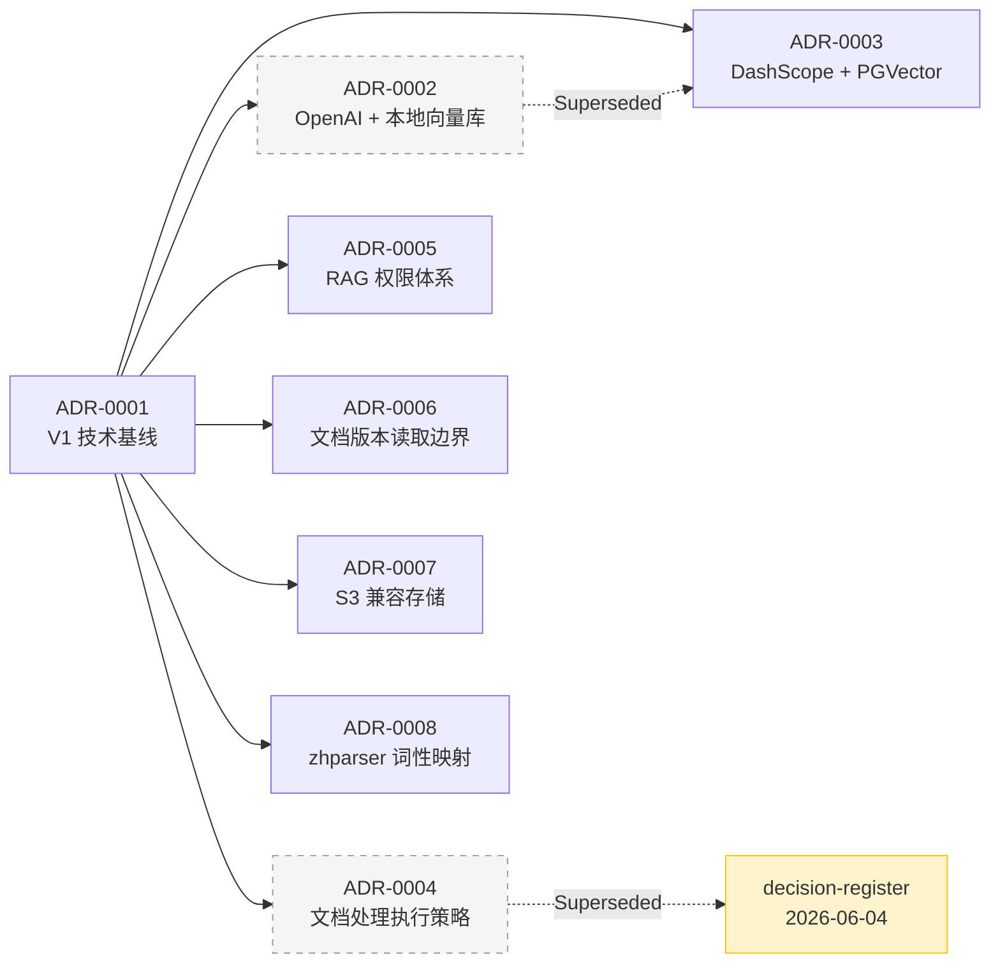

# 架构决策记录（ADR）索引

> ADR 记录项目中的重大技术决策及其理由。
> 模板：[ADR-0000-template.md](ADR-0000-template.md)

## 决策演化路径

## ADR 列表

### Active（Accepted）

| 编号 | 标题 | 日期 | 接受日期 |
|------|------|------|----------|
| [ADR-0001](ADR-0001-v1-tech-baseline.md) | V1 阶段固定单模型与单向量存储 | 2026-03-30 | 2026-03-30 |
| [ADR-0003](ADR-0003-v1-dashscope-pgvector.md) | V1 使用 DashScope + PostgreSQL(PGVector) | 2026-03-31 | 2026-03-31 |
| [ADR-0005](ADR-0005-rag-access-control-foundation.md) | RAG 权限体系基础决策 | 2026-05-08 | 2026-05-08 |
| [ADR-0006](ADR-0006-document-version-read-boundary.md) | 文档版本读取边界 | 2026-05-13 | 2026-05-13 |
| [ADR-0007](ADR-0007-s3-compatible-document-asset-storage.md) | 采用 S3 兼容文档资产存储 | 2026-05-19 | 2026-05-20 |
| [ADR-0008](ADR-0008-zhparser-pos-mapping.md) | zhparser 中文分词词性映射策略 | 2026-06-21 | 2026-06-21 |

### Superseded / Deprecated

| 编号 | 标题 | 状态 | 替代者 |
|------|------|------|--------|
| [ADR-0002](ADR-0002-v1-openai-simple-vectorstore.md) | V1 OpenAI + 本地向量库 | Deprecated | ADR-0003 |
| [ADR-0004](ADR-0004-v1-ingest-processing-strategy.md) | V1 文档处理执行策略 | Superseded | decision-register.md ⚠️ |

> 📍 ADR-0004 已由 `_bmad-output/planning-artifacts/research/decision-register.md` 替代。

## 相关规格文档

| 规格 | 关联 ADR | 说明 |
|------|----------|------|
| [文档版本读取边界规格](../specs/ingest/document-version-read-boundary-spec.md) | ADR-0006 | 详细的读取约束、权限边界、错误处理规则 |
