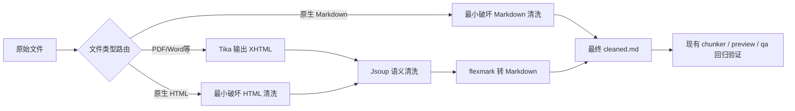

# ingest-cleaning：高质量 cleaned.md 优先计划

**版本**：1.4

**适用场景**：当前仓库既有 ingest 主链中的 parser / cleaner 质量基线与后续增强边界

**当前状态**：纯文字阶段已按当前代码实现收口；后续图片、表格、OCR 与 richer node model 需另行确认契约边界

**技术栈**：Apache Tika + Jsoup + flexmark-java

**模型生态**：阿里 DashScope（`text-embedding-v3`、`qwen3` 系列）

---

## 1. 文档定位

本计划描述的是当前 `ingest-cleaning` 轮次的**可执行优化范围**，不是脱离现状重新定义整条 ingest 链路的新“一期”。

当前仓库事实仍然是：

`源文件读取 -> 解析与清洗 -> cleaned.md 落盘 -> 分块 -> 向量化 -> 入库与状态收口`

本轮已经完成的是：

- parser / cleaner 的纯文字质量基线
- `cleaned.md` 作为可信、可分块、可回归验证的中间文本产物
- 使用现有 `documents/chunks/preview` 与固定 `qa.ask` 问题验证清洗优化是否真实改善后续消费效果

本轮**不做**的是：

- 重定义当前系统存在的分块、向量化、检索链路
- 升级 `RetrievedChunk`、`AskReferenceResponse` 或 `qa.ask` 对外契约
- 升级 `vector metadata shape`
- 修改 `Document` 主模型、Flyway、版本治理语义或外部 API 契约
- 落地父子分块或 richer node contract
- 做图片理解、OCR 或表格结构化节点

---

## 2. 本轮目标

本轮主目标不是升级 chunk 契约或检索契约，而是让 parser / cleaner 稳定产出高质量、可分块、可回归验证的 `cleaned.md`。

**本轮已经落地**

- 文件类型路由优化：区分 PDF / Word 等复杂格式、原生 Markdown、原生 HTML
- XHTML/HTML 清洗质量优化
- 标题、段落、列表、表格、代码块的 Markdown 还原质量优化
- `cleaned.md` 的稳定落盘与人工审阅能力
- 黄金样本、固定问题、人工审阅模板、回归基线准备
- 通过现有 chunk preview 与 `qa.ask` 做回归验证
- 基础 `processingMetadata` 自动构建与终态回填

**本轮明确不做**

- 父子分块落地
- 节点级 JSON 契约落地
- 检索与引用 DTO 升级
- 页码保留作为硬性通过条件
- 关键词抽取稳定作为硬性通过条件
- 图片理解、OCR 或表格节点建模

---

## 3. 验收口径

本轮“高质量 `cleaned.md`”收敛为以下 5 类硬性验收项：

1. **标题层级稳定**
- `h1/h2/h3` 与正文边界不粘连
- 不出现大段正文被误识别成标题

2. **段落边界可信**
- 重点解决弱结构 PDF 的幽灵换行、错误断段、错误拼接
- 不为了“看起来顺”而错误合并本应保留的结构换行

3. **结构块保真**
- 列表、表格、代码块不能明显退化成普通正文
- 原生 Markdown / HTML 不应被重解析链无谓破坏

4. **噪音可控**
- 页眉页脚、导航、重复块、非正文噪音应明显下降
- 不通过激进清洗误删正文

5. **对后续分块友好**
- `cleaned.md` 需要让现有 chunk preview 边界更稳
- `sourceHint` 需要更可解释
- 固定 `qa.ask` 问题需要更容易命中正确正文位置

以下内容**不纳入本轮硬性通过条件**：

- 页码保留
- 关键词抽取稳定
- 父子节点关系
- rich reference DTO
- 版本信息透出

---

## 4. 验证面约束

本轮允许使用 `documents/chunks/preview` 与固定 `qa.ask` 问题验证 `cleaned.md` 质量是否真实改善，但不以此为理由升级：

- `RetrievedChunk`
- `AskReferenceResponse`
- `vector metadata shape`
- `qa.ask` 对外契约

换句话说：

- `cleaned.md` 是主观察面
- `documents/chunks/preview` 是辅助验证面
- 固定 `qa.ask` 问题是最终回归面

---

## 5. 当前已落地流水线

这里要强调的是：

- 当前纯文字阶段优化重点已经落在 `B/C/D/E/F/G/H`
- `I` 保持当前验证角色，不升级为新契约入口

---

## 6. 当前实现要点

### 6.1 文件类型路由

- PDF / Word 等复杂格式继续走 `Tika -> Jsoup -> flexmark`
- 原生 HTML 按 `html` / `htm` 扩展名绕过 Tika，避免无谓语义降级
- 原生 Markdown 按 `md` / `markdown` / `mdown` / `mkd` 扩展名绕过 Tika 和 HTML 清洗主链，只做最小必要的不可见字符与噪音修正
- 原生文本严格解码失败时，回退 Tika 让其执行字符集检测

### 6.2 清洗规则重点

- 绝对删除：`script, style, noscript, link, meta, iframe, object, embed, applet` 与 HTML 注释
- 结构噪音剥离：导航、页眉页脚、重复块
- 标题映射：重点覆盖 `MsoTitle`、`MsoHeading*`
- 图片占位：保留最小描述，不在本轮引入视觉理解
- 幽灵换行修复：重点面向弱结构 PDF 的错误断句
- 表格：当前目标是保留 Markdown 可读形态，不生成表格节点或单元格级结构

### 6.3 内存与中间产物

- 复杂文档后续仍可考虑流式处理或分段处理，当前实现仍以字符串中间产物传递
- `cleaned.md` 必须稳定落盘，作为当前主链正式中间文本产物
- 如需保留 `raw.xhtml`、`cleaned.html`、`parse-result.json`，应作为调试产物，而不是本轮正式契约

### 6.4 状态与质量语义

- `high` / `low` / `warning` / `oversized` 等仅作为质量观察标签
- 它们不构成新的文档生命周期状态
- 本轮不引入新的数据库主状态名
- 若 parser 无法产出可继续消费的 `cleaned.md`，仍应按现有主链语义收口为 `FAILED`
- 若文本可继续消费但质量较弱，可通过 `processingMetadata` 表达质量信息，而不是发明新状态

### 6.5 术语约束

本轮文档与实现优先使用仓库既有术语：

- `documentId`
- `sourceFile`
- `processingMetadata`
- `cleaned.md`
- `sourceHint`

不在当前执行文档中另起一套 `doc_id`、`source_file` 一类并行术语。

---

## 7. 风险与取舍

### 7.1 当前接受的取舍

- 先把纯文本质量做深，再考虑父子分块
- 先把 `cleaned.md` 打牢，再考虑 richer node model
- 先用现有 preview / `qa.ask` 回归验证，不借机改对外契约

### 7.2 当前不接受的漂移

- 为了携带更多调试信息，顺手扩 `qa.ask` DTO
- 为了给未来父子分块埋字段，提前重塑当前检索契约
- 为了表达清洗结果，顺手把 `processingMetadata` 写成最终节点契约

---

## 8. 与后续计划的关系

- 父子分块、`nodeId`、`parentNodeId`、`childNodeIds` 等 richer node model，不属于本轮落地范围
- 如需讨论后续节点模型，统一参考同目录下的未来草案文档：
  - `docs/runbooks/plans/ingest-cleaning/RAG 文档节点标准数据契约.md`

---

## 9. 完成定义

纯文字阶段只有同时满足以下条件，才能宣称本轮 `ingest-cleaning` 完成：

- 黄金样本目录已落地
- 每类样本具备原始文件、README 与固定 QA 问题
- `cleaned.md` 在固定样本上满足 5 类硬性验收项
- chunk preview 在固定样本上没有出现“标题更好看但正文仍断裂”的假改进
- 固定 `qa.ask` 回归结果比基线更稳，或已明确记录为模型偶然变化而非 parser / cleaner 改善

如果优化不能在固定样本上让 `cleaned.md`、chunk preview 或固定 QA 结果变得更稳，就不应宣称本轮完成。

## 10. 下一轮优化前置判断

下一轮若进入图片、表格、OCR 或 richer node model，应先判断变化类型：

- 只改 `cleaned.md` 内的文字保留与噪音清理：仍属于 parser / cleaner 内部优化。
- 需要新增节点、父子关系、表格结构、图片 OCR 文本或引用字段：已经越过当前 `cleaned.md` 基线，需先同步契约。
- 需要改 `vector_store.metadata`、`qa.ask` response、`AskReferenceResponse` 或 `RetrievedChunk`：应先更新方案/ADR，再实现。
