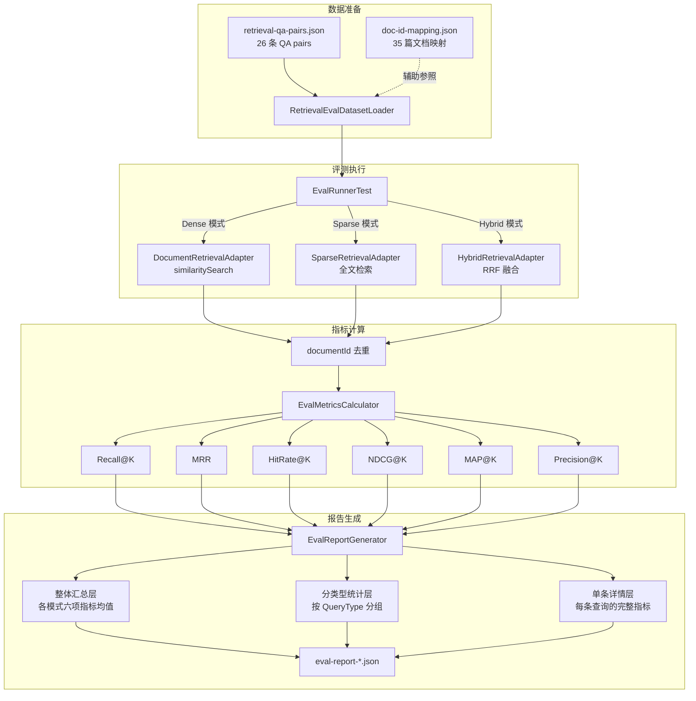

# RAG 检索评测指南

> 本文档说明如何运行 RAG 检索评测、解读报告、维护评测数据集。
> 评测框架对齐 BEIR（Benchmarking IR）标准，覆盖 6 项核心指标。

## 概述

### 为什么需要评测

RAG 系统的质量取决于检索层——LLM 只能基于检索到的上下文生成答案。评测的目的是：

- **量化检索质量**：不是"感觉还行"，而是有数字支撑
- **对比检索模式**：Dense（纯向量）vs Sparse（全文检索）vs Hybrid（混合）哪个更优
- **驱动优化决策**：指标下降 → 定位问题 → 调整 → 重跑验证

### BEIR 标准简介

BEIR 是信息检索领域的标准评测框架，定义了统一的指标体系和评测流程。本项目采用 BEIR 的 6 项核心指标，适配 RAG 场景做了以下调整：

- 检索结果按 **documentId 去重**（同一文档的多个 chunk 只算一次命中）
- 支持**分级相关度**：STRONG（强相关）和 WEAK（弱相关），用于 NDCG 加权
- CHITCHAT 类查询的 relevant_doc_ids 为空，指标默认返回 1.0（见 [已知限制](#已知限制)）

## 架构



## 指标体系

| 指标 | 含义 | 计算方式 | 适用场景 | 重点关注？ |
|------|------|----------|----------|------------|
| **Recall@5** | 前 5 条结果覆盖了多少比例的相关文档 | 命中数 / 总相关数 | 评估"不遗漏"能力 | ★★★ |
| **MRR** | 第一个相关文档出现在第几位 | 1/rank（多个命中取最优） | 评估"找到的速度" | ★★★ |
| **HitRate@5** | 前 5 条中是否至少命中一个相关文档 | 0 或 1（多条取均值） | 最直观的"有没有命中" | ★★ |
| **NDCG@5** | 考虑排序位置和相关度等级的综合评分 | DCG / IDCG（分级加权） | 评估排序质量 | ★★★ |
| **MAP@5** | 所有相关文档命中位置的平均精度 | 各命中位置 Precision 的均值 | 评估多相关文档场景的排序 | ★★ |
| **Precision@5** | 前 5 条中有多少是相关的 | 命中数 / 5 | 评估"不误报"能力 | ★ |

**分级相关度**：STRONG 对应 gain=2.0，WEAK 对应 gain=1.0（仅 NDCG 使用此加权）。

## 运行评测

### 前置条件

1. 本地 PostgreSQL 已启动（`cd infra && docker compose up -d`）
2. 相关文档已入库并完成向量化
3. Flyway migration 已执行（V10/V11 zhparser 配置）

### 执行命令

```bash
# 运行完整评测（Dense + Sparse + Hybrid 三模式对比）
mvn test -Dtest=EvalRunnerTest
```

报告输出位置：`target/eval-report-{timestamp}.json`

### 快速定位

```bash
# 查看最新报告
ls -lt target/eval-report-*.json | head -1
```

## 报告解读

报告为三层 JSON 结构：

### 第一层：整体汇总

```json
{
  "summary": {
    "total_queries": 26,
    "modes": {
      "dense": { "recall_at_5": 0.72, "mrr": 0.65, "ndcg_at_5": 0.68, ... },
      "sparse": { "recall_at_5": 0.58, "mrr": 0.50, "ndcg_at_5": 0.54, ... },
      "hybrid": { "recall_at_5": 0.75, "mrr": 0.70, "ndcg_at_5": 0.72, ... }
    }
  }
}
```

**重点看**：Hybrid 是否优于 Dense 和 Sparse？如果 Hybrid ≈ Dense，说明 Sparse 没有贡献（可能 zhparser 配置有问题）。

### 第二层：分 QueryType 统计

```json
{
  "by_query_type": {
    "FACTOID": { "dense": {...}, "sparse": {...}, "hybrid": {...} },
    "PROCEDURAL": { ... },
    "CHITCHAT": { ... }
  }
}
```

**重点看**：哪种 QueryType 的指标最低？那类查询是优化的优先方向。

### 第三层：单条详情

```json
{
  "details": [
    {
      "question": "Spring Boot 怎么配置 Flyway？",
      "query_type": "PROCEDURAL",
      "modes": {
        "dense": { "retrieved_ids": [...], "recall": 1.0, "mrr": 0.5, ... },
        "sparse": { "retrieved_ids": [...], "recall": 0.5, "mrr": 0.33, ... }
      }
    }
  ]
}
```

**重点看**：找到 recall=0 或 MRR 很低的条目，分析检索结果是否合理。

## 维护数据集

### 添加新 QA pair

1. 确认目标文档已在库中，获取其 documentId（从 `doc-id-mapping.json` 或数据库查询）
2. 编辑 `src/test/resources/eval/retrieval-qa-pairs.json`，添加一条：

```json
{
  "question": "你的问题",
  "query_type": "FACTOID",
  "relevant_doc_ids": ["doc-uuid-1", "doc-uuid-2"],
  "relevance_levels": {
    "doc-uuid-1": "STRONG",
    "doc-uuid-2": "WEAK"
  }
}
```

3. 更新 `src/test/resources/eval/doc-id-mapping.json`（如涉及新文档）
4. 运行 `RetrievalEvalDatasetLoaderTest` 验证格式正确：

```bash
mvn test -Dtest=RetrievalEvalDatasetLoaderTest
```

### 更新文档 ID 映射

```bash
# 使用 PowerShell 脚本从数据库导出最新映射
powershell -File scripts/export-doc-mapping.ps1
```

或手动编辑 `doc-id-mapping.json`。

### 校验规则

数据集加载时自动校验：

- `question`、`query_type`、`relevant_doc_ids`、`relevance_levels` 为必填字段
- `query_type` 必须是 `QueryType` 枚举值
- `relevance_levels` 中每个 `relevant_doc_ids` 的 ID 都必须有对应标注
- `relevance_levels` 的值必须是 `STRONG` 或 `WEAK`

校验失败时抛出 `IllegalArgumentException`，错误信息包含具体原因。

## 已知限制

### CHITCHAT 查询虚假满分 ⚠️

CHITCHAT 类查询（闲聊）的 `relevant_doc_ids` 为空——这是设计上的正确行为（闲聊不需要检索文档）。但当前指标计算逻辑中，空相关文档集会导致所有指标默认返回 **1.0**：

- Recall@5：1.0（无需召回任何文档 → 完美召回）
- MRR：1.0（无相关文档 → 排名逻辑返回 1.0）
- 其余指标同理

**影响**：整体指标均值被 CHITCHAT 的 1.0 拉高，不能准确反映实际检索性能。

**使用建议**：评估检索性能时，关注 `by_query_type` 中 FACTOID / PROCEDURAL / ANALYTICAL 的指标，**不将 CHITCHAT 计入性能评估**。

**后续计划**：在报告生成层显式标注 CHITCHAT，或从整体均值中排除。
