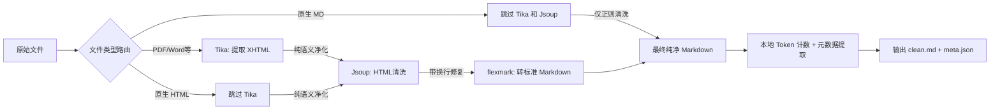

# RAG 文档处理一期执行计划

**版本**：1.2

**适用场景**：多格式文档 → 清洗后 Markdown + 元数据

**技术栈**：Apache Tika + Jsoup + flexmark‑java

**模型生态**：阿里 DashScope（`text-embedding-v3`、`qwen3` 系列）

---

## 1\. 项目目标与边界

将任意常规办公文档（PDF、Word、Markdown、HTML 等）转化为**干净、结构完整的 Markdown 全文**，并附带轻量元数据，为二期智能分块提供唯一可信数据源。

**一期明确做**

- 格式解析 → XHTML（Tika）
- 语义清洗 → 净化 HTML（Jsoup）
- 格式转换 → 标准 Markdown（flexmark）
- Token 计数与元数据封装

**一期明确不做**

- 任何形式的分块（切分段落、窗口分割）
- 构建带有 `index_content` / `display_content` 的 RAG 节点 JSON
- 向量化、检索、存储到向量库
- 多模态图片理解（仅为图片预留 token 预算）

**一期输出物**（每个文档）

- `{doc_id}.clean.md`：清洗后的 Markdown 全文
- `{doc_id}.meta.json`：轻量元数据（不含内容字段，仅供二期参考）

> 这样划分的原因：一期专注于内容还原，生成可流式读取的 Markdown；二期专注于模型适配，按窗口切分并构建检索节点。两者解耦后，内存管理、独立测试、未来升级都变得简单。

---

## 2\. 数据流水线



**各环节职责**
| 组件 | 唯一作用 | 特别说明 |
|---|---|---|
| 格式路由 (新增) | 根据源文件类型分发流水线 | .md 和规范 .html 绕过 Tika，防止原生代码块或锚点属性丢失。 |
| Apache Tika | 格式适配：读 PDF/Word 等，输出 XHTML | 仅作为 fallback 解析器，不涉及清洗逻辑。 |
| Jsoup | HTML 清洗：删除噪音标签，标准化语义结构 | 处理后输出干净 DOM。 |
| flexmark-java | 格式转换：洁净 HTML → 标准 Markdown | 转换前后包含「幽灵换行修复」逻辑。 |
| 封装层 | Token 本地计算 + 生成 meta.json | 绝对杜绝网络 IO 计算 Token。 |

---

## 3\. 实施要点

### 3.1 Tika 解析与内存安全

**基础用法（仅小文档）**

```java
String xhtml = new Tika().parseToString(inputStream);
```

**强制规则**

- 单个原始文档 ≤ 50MB，超过则标记 `quality = "oversized"` 并跳过，不阻塞管线。
- PDF 优先使用文本型解析；扫描件标记 `quality = "low"`，保证不中断工序。

#### 3.1.1 内存安全与中间产物落盘（重要）

为防止大文档（复杂排版、扫描件）消耗过多 JVM 堆内存，一期严格遵循：

- **流式解析优先**：对 PDF 等可分页格式，按页提取并清洗，避免一次性加载整份 XHTML。可使用 Tika 的 `Parser` + `ContentHandler` 或 Apache PDFBox 逐页产出 HTML 片段，再交给 Jsoup 处理，使内存开销与单页复杂度绑定。
- **全量 DOM 仅为备选**：仅当文档体积较小（如 <10MB 的简单 Word）且结构简单时，才使用 `parseToString()` 全量加载。
- **处理完立即释放**：一个文档结束后，主动将 DOM、大字符串等引用置 `null`，加速 GC。
- **中间产物落盘**：清洗后的 Markdown 全文 **必须写入文件系统或对象存储**，不能仅保留在内存中。文件名与 `doc_id` 强关联（如 `doc_123.clean.md`），方便二期分块器流式读取。
- **JVM 参数建议**：测试环境分配 `-Xmx2g`，避免正常波动导致 OOM。

### 3.2 Jsoup 分层清洗

按 **删除 → 结构噪音 → 语义保留 → 格式抛光** 顺序处理：

1. **绝对删除**：`script, style, noscript, link, meta, iframe, object, embed, applet` 以及 HTML 注释。
2. **结构噪音剥离**
    - 使用可配置黑名单选择器（`nav, footer, header, [class*='nav']` 等）。
    - 保留含标题的 `header`（内部存在 `<h1>-<h6>` 且文本占比 >60%）。
    - 可选去重逻辑：若分页场景下出现跨页重复块，自动去除。

3. **语义标签标准化**
    - 将 Word 转换出的 `p.MsoTitle` → `h1`，`p.MsoHeading1` → `h1` 等。
    - 保留表格、列表、链接、代码块原样。

4. **图片占位**
    - 所有 `` 替换为 `🖼️ {alt文本}`，保留描述信息；无 `alt` 时使用 `🖼️ 图片`。
    - **说明**：该占位符留在 Markdown 中，二期仍以文本形式存在，可能略微干扰检索精准度，但可以保证图片信息不丢失并为多模态 token 预留空间；三期引入视觉描述后将自动替换。

5. **去除内联样式**：移除所有 `style`、`class`、`id` 属性。
6. **白名单终抛**：可选使用 `Jsoup.clean` 保留允许的标签，去除意外残留。
7. **幽灵换行缝合（PDF 特供）**：
    - 背景：Tika 解析 PDF 时常会把一段连贯的文字因排版原因强行加入 \n，导致转 Markdown 后句子被硬斩断，严重破坏二期按句分块的逻辑。
    - 执行逻辑：在 Jsoup 提取纯文本或 flexmark 转换前，增加启发式正则替换拦截器。
    - 参考正则规则：当探测到换行符前是“中文字符或逗号”，且换行符后紧接着“中文字符或小写字母”时，强制将 \n 替换为无空格或单空格缝合句子。（例如正则式：(?<=[，、\u4e00-\u9fa5])\n(?=[\u4e00-\u9fa5a-z])）。

所有规则外部化到 `cleaner-config.yml`。

### 3.3 flexmark‑java 转换

```java
String markdown = FlexmarkHtmlConverter.builder().build().convert(cleanHtml);
```

- 使用 `flexmark-html2md-converter` 扩展，支持表格、列表、代码块、图片占位。
- 若个别复杂 HTML 转换不佳，可增补后处理规则（如多余空行合并）。

### 3.4 最终产出：`clean.md` 与 `meta.json`

**一期元数据 Schema（**`{doc_id}.meta.json`**）**

```json
{
	"doc_id": "doc_123",
	"source_file": "report.pdf",
	"file_type": "pdf",
	"total_pages": 15,
	"language": "zh",
	"token_count": 12400,
	"tokenizer_type": "qwen_v3_base",
	"h1": "第一章 概述",
	"h2": "1.1 背景",
	"h3": null,
	"keywords": ["营收", "增长", "Q4"],
	"quality": "high",
	"created_at": "2025-03-27T10:00:00Z"
}
```

| 字段             | 类型   | 必填 | 说明                                                 |
| ---------------- | ------ | ---- | ---------------------------------------------------- |
| `doc_id`         | string | ✅   | 文档唯一 ID，用于关联 `clean.md` 与最终节点。        |
| `source_file`    | string | ✅   | 原始文件名。                                         |
| `file_type`      | string | ❌   | 文件扩展名。                                         |
| `total_pages`    | int    | ❌   | 总页数（可分页格式时填写）。                         |
| `language`       | string | ❌   | 语言代码，可填 `"mixed"`。                           |
| `token_count`    | int    | ❌   | 全文 token 总数（供分块决策）。                      |
| `tokenizer_type` | string | ❌   | 分词器标识，固定 `"qwen_v3_base"`。                  |
| `h1`, `h2`, `h3` | string | ❌   | 文档最高级别标题路径（二期注入用）。                 |
| `keywords`       | array  | ❌   | 关键实体词。                                         |
| `quality`        | string | ❌   | 解析质量：`high` / `low` / `warning` / `oversized`。 |
| `created_at`     | string | ❌   | ISO 8601 时间戳。                                    |

> 一期 **不产出** `chunk_index`、`total_chunks`、`index_content`、`display_content` 等字段，这些由二期分块器生成。

### 3.5 模型生态与 Token 对齐

#### 3.5.1 技术栈绑定

全链路绑定阿里 DashScope 生态，一期预处理须与以下参数对齐：

- 向量化：`text-embedding-v3`（最大 2048 Token）
- 重排：`gte-rerank-v2`
- 生成：`Qwen3` 系列
- 多模态（未来）：`qwen3-vl` 系列

#### 3.5.2 Token 计数标准

- **基准分词器**：必须使用 DashScope 官方 Java SDK 的 `TokenizationService` 计算，禁止使用简单字符计数或 `tiktoken`。
- **计数缓存**：对重复文本段引入 LRU 缓存，避免重复调用 API；长文档可使用批量接口减少网络往返。
- **多模态图片预留**：识别到 `🖼️` 占位符时，每个图片固定增加 **448 token**（参照 `qwen3-vl` 文档），写入 `token_count`。
- **tokenizer_type 字段**：在 `meta.json` 中固定为 `"qwen_v3_base"`。

#### 3.5.3 为二期分块预留的硬性阈值

以下参数仅记录在计划中，供二期分块器使用：

- **子块目标区间**：**512 – 800 Tokens**（实验表明 512 左右忠实度最佳，且有利于重排任务）。
- **安全冗余 (Buffer)**：预留 **15% Token 空间**，用于注入标题路径（如 `h1>h2>h3`），防止总长度超限。
- **标题栈预记录**：一期在 `meta.json` 的 `h1`/`h2`/`h3` 中保存文档最高层级标题，二期分块时可据此构建注入前缀。

---

## 4\. 潜在风险与解决方案

| 风险点                              | 表现                                                            | 应对方案                                                                                                                                |
| ----------------------------------- | --------------------------------------------------------------- | --------------------------------------------------------------------------------------------------------------------------------------- |
| 扫描件 PDF 无结构                   | Tika 输出纯 `<div>`，无标题                                     | ① 标记 `quality="low"`；② 降级为纯文本提取，按空行分段输出基础 Markdown。                                                               |
| 超大文档一期产出远超 Embedding 窗口 | 清洗后 Markdown 全文达数万 token，若直接提交 Embedding 会被截断 | 一期**不负责保障单节点可送入向量库**；仅在 `meta.json` 中标记 `quality="warning"` 并记录 token 数；二期分块器会自动切分为多个窗口子块。 |
| 表格过大导致单块超限                | 大表格 Markdown 化后超过 2048 token                             | 一期不做拆分，仅记录 `token_count`；二期分块器可对表格按行切分并建立父子节点。                                                          |
| 标题识别不准确                      | Word 文档标题使用非标准 class                                   | ① 配置多套候选选择器；② 允许人工映射（二期功能）。                                                                                      |
| 清洗后图片信息丢失                  | 图片无 `alt` 或删除后语义断裂                                   | 自动填入 `🖼️ 图片` 占位符，并计入 448 token；二期文本检索时会保留该占位符，三期多模态可替换为描述。                                     |
| 多语言混排误判                      | 语言检测偏向低频词                                              | 使用 Tika 语言检测仅供参考，允许 `language="mixed"`，不强制单一语言。                                                                   |
| Jsoup 内存溢出                      | 大型 XHTML DOM 树占用过高                                       | ① 文件大小限制；② 流式解析优先，避免整棵 DOM 树同时加载。                                                                               |
| flexmark 转换异常                   | 特殊嵌套标签产出畸形 Markdown                                   | 前置 Jsoup 白名单已大幅降低风险；增加转换后规范性校验，异常时告警并回退存储原始文本。                                                   |
| Tokenizer 调用延迟                  | 频繁调用 API 拖慢处理                                           | ① 本地 LRU 缓存；② 批量接口调用；③ 未来可考虑离线分词器。                                                                               |
| 中英混排 Token 激增                 | 纯英文分词器处理中文时 Token 膨胀 3 倍                          | 坚持使用阿里 Qwen 专属分词器（`qwen_v3_base`），双语优化确保计数准确。                                                                  |

---

## 5\. 一期产出与二期入口

- **一期交付物**：`clean.md`（流式可读） + `meta.json`（结构信息）。
- **二期对接方式**：
    - 分块器读取 `meta.json` 获取文档基础信息及 token 总数。
    - 以流式方式（`BufferedReader` 逐行读取）消费 `clean.md`，根据标题、空行等语义边界实时计算 token 并生成子块。
    - 分块器内存占用量与文档总大小无关，从根本上消除大文档 OOM 风险。

- **二期将为每个子块构建完整的 RAG 节点 JSON**，此时才填充 `node_id`、`index_content`、`display_content`、`chunk_index`、`total_chunks`、`parent_id` 等字段。

---
