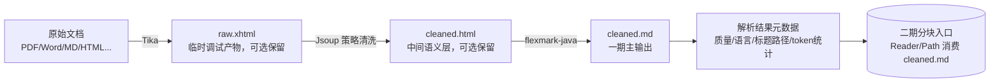

## RAG 文档处理一期执行计划（纯文本解析与清洗）

---

### 1. 项目目标与边界

构建**多格式文档 -> 干净标准 Markdown 中间产物 -> 二期分块输入**的预处理管线，为后续分块、向量化和检索提供稳定、可回放、可观测的文本基座。

- **输入**：用户上传的常规办公文档（PDF、Word、Markdown、HTML 等）。
- **一期主输出**：清洗后的 `cleaned.md`（标准 Markdown 文本文件）以及最小必要的解析结果元数据；**不是**最终 JSON 节点，也**不是**向量化输入对象。
- **二期输入**：分块模块读取 `cleaned.md` 或其对应的 `Reader/Path`，再生成真正的节点对象与分块索引。
- **不包含**：新的分块策略、父子节点构建、向量化、检索逻辑。这些均在二期实现。
- **允许范围**：为接入 `cleaned.md` 主链和 `Path/Reader` 输入边界，可对**现有 chunker** 做兼容性优化，但不在一期引入新的节点模型和新的分块策略。
- **核心工具链**：Apache Tika（解析） -> Jsoup（清洗） -> flexmark-java（转换 Markdown）。
- **设计目标**：优先解决提取质量、文本稳定性、处理中间态可观测性，以及大文件场景下的 JVM 峰值内存问题。

### 1.1 阶段边界补充

一期只负责把原始文档转成**可稳定消费的纯文本/Markdown 中间产物**，并记录最小必要元数据。以下能力明确后置：

- 节点 Schema 落库
- 智能分块与父子块构建
- Embedding、Rerank、生成模型调用
- 多模态图片理解、表格摘要、代码专属节点

这样做的目的，是先把“文本提取与清洗”从“检索节点设计”中解耦，降低一期复杂度。

补充说明：一期虽然不引入新的分块策略，但允许围绕现有 chunker 做**兼容性优化**，例如：

- 将 chunker 输入从内存字符串演进为 `Path/Reader`
- 为 `cleaned.md` 主链适配标题、段落等基础语义
- 保持现有 preview / QA 消费链路在可验证前提下继续工作

不允许的内容包括：

- 新的节点模型
- 新的父子块组织方式
- 与现有分块口径明显不兼容的全新切分策略

---

### 2. 数据流水线（含精确角色分工）



**每个环节的精确职责**：

| 组件              | 唯一作用                                                | 不做什么                    |
| ----------------- | ------------------------------------------------------- | --------------------------- |
| **Apache Tika**   | 文档格式适配：读取多格式文档，输出可清洗的 XHTML/文本流 | 不负责清洗、不负责节点封装  |
| **Jsoup**         | HTML 清洗：删除噪音标签，标准化标题与语义结构           | 不自己做 Markdown 转换      |
| **flexmark-java** | 格式转换：将干净 HTML 转换为标准 Markdown               | 不参与内容清洗              |
| **元数据层**      | 记录最小必要元数据，如质量、语言、标题路径、token 统计  | 不做分块、不做向量化        |
| **分块入口层**    | 对二期暴露 `Path/Reader` 级输入边界                     | 不在一期提前实现节点 Schema |

### 2.1 中间产物策略

一期采用“**主链产物 + 调试旁路产物**”模式：

- **主链强制产物**：`cleaned.md`
- **调试旁路产物**：`raw.xhtml`、`cleaned.html`
- **默认策略**：生产主链只要求稳定生成 `cleaned.md`
- **调试策略**：问题定位、抽样检查或灰度期间，可额外保留 `raw.xhtml` / `cleaned.html`

这样既保留排障能力，也避免所有文档都长期持久化冗余中间文件。

---

### 3. 实施要点（含关键代码模式与模型对齐）

#### 3.1 Tika 解析

- 限制单文件 ≤50MB，防止大文件内存溢出。
- 对 PDF 优先使用文本型解析；扫描件或弱结构文本标记为低质量，并写入解析结果元数据。
- **一期不建议继续沿用 `parseToString(...)` 作为主实现**，而应优先改为 `Writer/OutputStream` 输出到临时文件，减少“整份字符串长期停留在 JVM 内存”的峰值风险。
- 推荐接口边界：
    - 解析器输出：`Path rawXhtmlPath` 或 `Reader`
    - 清洗器输入：`Path/Reader`
    - 分块器输入：`Path cleanedMarkdownPath` 或 `Reader`

> 说明：一期目标是“降峰值 + 提升可回放性”，不是承诺完全流式。Tika 可以更接近流式，但 Jsoup 仍然是 DOM 型处理组件。

#### 3.2 Jsoup 分层清洗

按照 **必须删除 → 结构噪音 → 语义保留 → 格式抛光** 的顺序处理：

1. **绝对删除**：`script, style, noscript, link, meta, iframe, object, embed, applet` 以及 HTML 注释。
2. **结构噪音剥离**：
    - 使用可配置黑名单选择器（`nav, footer, header, [class*='nav']` 等）。
    - 保留含标题的 `header`（避免误删文章头部）。
    - 可选去重逻辑：若分页场景下发现跨页重复块，自动去除。
3. **语义标签标准化**：
    - 将 Word 转换出的 `p.MsoTitle` → `h1`，`p.MsoHeading1` → `h1` 等。
    - 保留表格、列表、链接、代码块原样，不做降级。
4. **图片占位（一期仅保留文本语义）**：
    - 将所有 `` 替换为普通文本占位，如 `[图片: alt文本]` 或 `[图片]`。
    - 一期只要求避免图片位置导致正文断裂，**不要求**引入多模态预算计算。
5. **去除内联样式**：移除所有 `style`、`class`、`id` 属性，防止干扰 Markdown 生成。
6. **白名单终抛**：可选调用 `Jsoup.clean` 保留允许的块级/行内标签，去除意外残留。

所有选择器与规则外部化到 `cleaner-config.yml`，不同文档源可灵活调整。

#### 3.3 flexmark-java 转换

```java
String markdown = FlexmarkHtmlConverter.builder().build().convert(cleanHtml);
```

- 选用 `flexmark-html2md-converter` 扩展，支持表格、列表、链接、图片占位的标准 Markdown 输出。
- 如个别复杂 HTML 转换不佳，可增补后处理规则（如多余空行合并）。

#### 3.4 最终封装

- 一期主结果为 `cleaned.md` 文件，不要求直接落成最终 node JSON。
- 解析阶段可产出 `parse-result.json` 作为文件化载体，但其**正式身份**应定义为处理结果元数据（Processing Metadata），最终由 worker 写入 `ingest_documents.processing_metadata`（JSONB）列。
- `processing_metadata` 是正式生产数据，`parse-result.json` 只是其中间落盘形式或回放副本；**数据库字段是事实来源，文件不是最终权威对象**。
- `processing_metadata` 不作为独立状态查询入口，而是文档处理记录的附加字段：
  - `UPLOADED` / `INGESTING`：`processing_metadata = null`
  - `INDEXED` / `FAILED`：返回状态时可顺带返回 `processingMetadata`
- 现有 `failure_reason`、`last_error_code`、`last_error_message` 继续承担错误状态职责；`processing_metadata` 只负责承载处理结果特征，不重复保存错误主信息。
- 元数据按“稳定输出 / 条件输出 / 暂不保证”分层管理：
  - **稳定输出**：`source_file`、`file_ext`、`mime_type`、`quality`、`created_at`
  - **条件输出**：`language`、`page_count`、`primary_title`、`title_outline_sample`
  - **暂不保证**：`keywords`、复杂版面定位、图片语义摘要

推荐的 `processing_metadata` 结构如下：

```json
{
  "schema_version": "v1",
  "stable": {
    "source_file": "xxx.pdf",
    "file_ext": "pdf",
    "mime_type": "application/pdf",
    "quality": "high",
    "created_at": "2026-05-09T10:30:00Z"
  },
  "conditional": {
    "language": "zh-CN",
    "page_count": 42,
    "primary_title": "第一章 背景",
    "title_outline_sample": ["第一章", "1.1 背景"]
  },
  "best_effort": {
    "keywords": ["RAG", "向量化"]
  }
}
```

字段设计说明：

- `file_ext` 与 `mime_type` 分开存储，避免“文件扩展名”和“MIME 类型”语义混淆
- `page_count` 表示文档总页数，不使用 `page_num` 这类偏节点级的定位字段
- `primary_title` / `title_outline_sample` 表示文档级标题提取结果，不等价于分块节点上的标题路径
- `best_effort` 仅在算法稳定产出时回填，不作为状态推进前置条件

> 进度快照（2026-05-09）：
> `processing_metadata` 的数据库字段、schema 自检以及状态接口终态返回基础能力已落地；
> `cleaned.md` 主链产物、`raw.xhtml -> cleaned.html -> cleaned.md` 中间产物链路与基础元数据自动回填已落地；
> 更精细的文档质量分级、复杂页码/标题语义提取仍待后续阶段继续实现。

---

#### 3.5 模型生态与 Token 对齐（前瞻预留）

##### 3.5.1 技术栈绑定

本项目后续计划接入阿里 DashScope（灵积）生态，因此一期可适度保留兼容字段，但**不应将这些字段写成一期主验收门槛**：

- **向量化（Embedding）**：`text-embedding-v3`（最大窗口 2048 Token）
- **重排（Rerank）**：`gte-rerank-v2`
- **生成（LLM）**：`Qwen3` 系列
- **多模态（未来）**：`qwen3-vl` 系列

##### 3.5.2 Token 计数标准（一期可选增强）

为防止解析阶段的长度估算与后续 Embedding/生成阶段发生冲突，一期必须落实：

- **推荐做法**：若一期要统计 token，优先使用 DashScope 官方 Java SDK 提供的 `TokenizationService`。
- **输出形式**：建议把 `token_count`、`tokenizer_type` 记录在轻量元数据里，供二期分块器参考。
- **落地约束**：若 token 计数接入成本过高，可作为一期增强项，而不是阻塞主流程交付。

##### 3.5.3 为二期分块预留的参考阈值

基于论文最佳实践与阿里模型特性，设定以下参数供二期分块器参考使用；一期仅记录必要元数据，不在主流程内强制执行：

- **子块目标区间**：**512 – 800 Tokens**
  决策理由：虽然 `text-embedding-v3` 支持 2048，但实验证明 512 左右的块在“忠实度”上表现最佳，且有利于 `gte-rerank` 的精细化打分。
- **安全冗余 (Buffer)**：建议为标题路径注入预留约 **15% 的 Token 空间**。
- **预记录**：一期若能稳定提取标题层级栈，可记录 `title_path` 供二期复用；若无法稳定提取，则允许为空。

##### 3.5.4 多模态预留（不进入一期主验收）

图片占位、多模态 token 预算、视觉模型对齐等内容，只作为后续设计预留写入文档，不纳入一期主流程，不影响一期交付。

---

### 4. 潜在风险与解决方案（含新增模型相关风险）

| 风险点                            | 表现                                                         | 应对方案                                                                                                                                   |
| --------------------------------- | ------------------------------------------------------------ | ------------------------------------------------------------------------------------------------------------------------------------------ |
| **扫描件 PDF 无结构**             | Tika 输出纯 `<div>`，无 h1-h6                                | ① 标记文档质量 `low`；② 降级为 Tika 纯文本提取，按空行分段输出基础 Markdown。                                                              |
| **表格过大导致单节点 token 超限** | 大表格 Markdown 化后超过模型上下文窗口                       | ① 本期不做拆分，但在元数据中记录 `token_count`，超过阈值则标记警告；② 二期按行拆分表格并建立父子节点。                                     |
| **标题识别不准确**                | Word 文档标题使用非标准 class                                | ① 配置多套候选选择器，按优先级匹配；② 提供用户手动标题映射界面（二期功能）。                                                               |
| **清洗后图片信息丢失**            | 图片无 `alt` 属性或删除图片后语义断裂                        | ① 对无 `alt` 的图片自动填入 `[图片]` 占位符；② 占位符格式统一，方便后续扩展；③ 一期不强制进行视觉 token 预算。                             |
| **多语言混排误判**                | 语言检测偏向低频词                                           | ① 使用 Tika 内置语言检测，仅作为 `metadata.language` 参考值；② 不强制单语言，不截断混合内容。                                              |
| **Jsoup 内存溢出**                | 大型 XHTML DOM 树占用过高                                    | ① 限制文件大小；② 对超大文档先流式分段后分别清洗。                                                                                         |
| **flexmark 转换异常**             | 特殊嵌套标签转换出畸形 Markdown                              | ① 前置 Jsoup 白名单过滤已极大降低风险；② 增加转换后的 Markdown 规范性校验（正则扫面、模拟渲染），发现异常抛告警并回退存储原始文本。        |
| **Tokenizer 调用延迟**            | 逐条解析时频繁调 DashScope API 导致处理变慢                  | ① 引入本地化缓存（LRU）；② 批量调用 Tokenization 接口；③ 如一期交期紧张，可先将 token 计数降为增强项。                                     |
| **Embedding 窗口截断**            | 解析阶段 token 估算不准，导致后续 Embedding 时文本尾部被截断 | ① 在元数据中记录 token_count 供二期参考；② 安全冗余策略在二期分块时强制执行，而不是一期阻塞项。                                            |
| **临时文件膨胀**                  | raw.xhtml / cleaned.html / cleaned.md 占用磁盘               | ① 默认仅长期保留 `cleaned.md`；② `raw.xhtml` 与 `cleaned.html` 作为调试旁路按需保留；③ 配置清理策略和保留周期。                            |
| **“落文件”但仍高内存**            | 处理中依然把整份内容拼成大字符串                             | ① parser / cleaner / chunker 接口改为 `Path/Reader` 级；② 避免以 `String` 作为跨模块主接口；③ 明确 Jsoup 属于 DOM 型处理，必要时拆段处理。 |
| **元数据权威源不清**              | parse-result.json 与数据库字段内容不一致                     | ① 明确 `ingest_documents.processing_metadata` 为事实来源；② `parse-result.json` 仅作为文件化载体或回放副本；③ 状态查询只读数据库字段。      |
| **中英混排 Token 激增**           | 纯英文 Tokenizer 处理中文时，Token 数会膨胀 3 倍             | 坚持使用阿里 Qwen 专属分词器，该分词器针对中英双语优化，可保证计数准确；计数器固定在 `qwen_v3_base` 不可替换。                             |

---

### 5. 一期产出与二期入口

- **一期交付物**：清洗后的 `cleaned.md` + 轻量级解析结果元数据，可直接被二期分块器读取。
- **状态查询增强**：当文档进入 `INDEXED` / `FAILED` 时，可随状态查询结果一并返回 `processingMetadata`，补足“只有阶段、没有处理细节”的可观测性缺口。
- **二期预告（不在本期范围）**：
    - 智能分块：基于 Markdown 标题、段落、token 上限（参考 3.5.3 阈值）自动生成父子块。
    - 表格专项优化：将表格节点类型改为 `table`，`index_content` 替换为语义摘要。
    - 向量化与检索集成：调用 Spring AI Embedding 将节点转向量库，开启搜索。
    - 多模态扩展：利用图片占位 token 预算，接入 `qwen3-vl` 处理图内信息。

---

此计划严格遵循三个约束：

1. 不提前实现分块，先交付稳定的纯文本中间产物；
2. 通过 `Path/Reader` 级接口和临时文件链路降低 JVM 峰值内存；
3. 未来模型、多模态、节点 Schema 仅作预留，不绑死一期主交付。

可直接作为技术设计评审与一期开发排期的最终依据。
