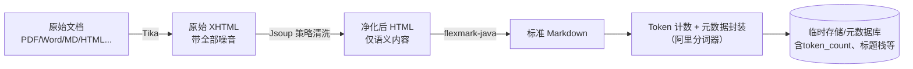

## RAG 文档处理一期执行计划（解析与清洗）

---

### 1. 项目目标与边界

构建**多格式文档 → 干净标准 Markdown + 统一 JSON Schema 节点**的预处理管线，为二期智能分块和模型调用提供唯一数据源。

- **输入**：用户上传的常规办公文档（PDF、Word、Markdown、HTML 等）。
- **输出**：每条文档产出一个 JSON 对象，严格符合预留的 JSON Schema（`metadata` + `index_content` + `display_content` 等字段），其中 `index_content` 与 `display_content` 完全相同，均为清洗后的 Markdown 全文。
- **不包含**：任何分块、父子节点构建、向量化、检索逻辑。这些均在二期实现。
- **核心工具链**：Apache Tika（解析 → XHTML） → Jsoup（清洗 → 干净 HTML） → flexmark-java（HTML → Markdown）。
- **模型生态绑定**：一期预处理必须与阿里 DashScope 全套模型对齐，确保后续 Embedding/生成无缝衔接。

---

### 2. 数据流水线（含精确角色分工）



**每个环节的精确职责**：

| 组件              | 唯一作用                                                                  | 不做什么                    |
| ----------------- | ------------------------------------------------------------------------- | --------------------------- |
| **Apache Tika**   | 文档格式适配：读取任何格式，输出 XHTML                                    | 不负责清洗、不转换 Markdown |
| **Jsoup**         | HTML 清洗：解析 XHTML，删除噪音标签，标准化标题、图片占位等，保留语义结构 | 不自己做 Markdown 转换      |
| **flexmark-java** | 格式转换：将干净 HTML 转换为工业级标准 Markdown                           | 不参与内容清洗              |
| **Token 计数层**  | 使用 DashScope 官方分词器精确计算文档 token 数，写入元数据                | 不修改内容、不做分块        |
| **封装层**        | 按 JSON Schema 组装最终节点对象，包括元数据注入                           | -                           |

---

### 3. 实施要点（含关键代码模式与模型对齐）

#### 3.1 Tika 解析

```java
String xhtml = new Tika().parseToString(inputStream);
```

- 限制单文件 ≤50MB，防止大文件内存溢出。
- 对 PDF 优先使用文本型解析；扫描件标记为低质量，并写入 `metadata.quality` 字段。

#### 3.2 Jsoup 分层清洗

按照 **必须删除 → 结构噪音 → 语义保留 → 格式抛光** 的顺序处理：

1. **绝对删除**：`script, style, noscript, link, meta, iframe, object, embed, applet` 以及 HTML 注释。
2. **结构噪音剥离**：
    - 使用可配置黑名单选择器（`nav, footer, header, [class*='nav']` 等）。
    - 保留含标题的 `header`（避免误删文章头部）。
    - 可选去重逻辑：若分页场景下发现跨页重复块，自动去除。
3. **语义标签标准化**：
    - 将 Word 转换出的 `p.MsoTitle` → `h1`，`p.MsoHeading1` → `h1` 等。
    - 保留表格、列表、链接、代码块原样，不做降级。
4. **图片占位**：
    - 将所有 `` 替换为 `🖼️ {alt文本}`，保留原始描述信息。此占位符后续将参与多模态 token 预留计算。
5. **去除内联样式**：移除所有 `style`、`class`、`id` 属性，防止干扰 Markdown 生成。
6. **白名单终抛**：可选调用 `Jsoup.clean` 保留允许的块级/行内标签，去除意外残留。

所有选择器与规则外部化到 `cleaner-config.yml`，不同文档源可灵活调整。

#### 3.3 flexmark-java 转换

```java
String markdown = FlexmarkHtmlConverter.builder().build().convert(cleanHtml);
```

- 选用 `flexmark-html2md-converter` 扩展，支持表格、列表、链接、图片占位的标准 Markdown 输出。
- 如个别复杂 HTML 转换不佳，可增补后处理规则（如多余空行合并）。

#### 3.4 最终封装

- 产出的 Markdown 全文同时填入 `index_content` 和 `display_content`。
- `parent_id`、`child_ids` 置为 `null`。
- `metadata` 中包含：源文件名、页码、标题层级栈、语言、文档质量标志、token 估算数、`tokenizer_type` 等（具体字段见独立 JSON Schema 文档，本期按约定填充即可）。

---

#### 3.5 模型生态与 Token 对齐（一期预处理准备）

##### 3.5.1 技术栈绑定

本项目核心链路全面绑定阿里 DashScope（灵积）生态，一期预处理必须确保与以下模型参数对齐：

- **向量化（Embedding）**：`text-embedding-v3`（最大窗口 2048 Token）
- **重排（Rerank）**：`gte-rerank-v2`
- **生成（LLM）**：`Qwen3` 系列
- **多模态（未来）**：`qwen3-vl` 系列

##### 3.5.2 Token 计数标准（解决“不对齐”风险）

为防止解析阶段的长度估算与后续 Embedding/生成阶段发生冲突，一期必须落实：

- **基准分词器**：统一使用 DashScope 官方 Java SDK 提供的 `TokenizationService` 进行计数，禁止使用简单字符计数或 OpenAI 的 `tiktoken`。
- **Schema 增强**：在 JSON 节点的 `metadata` 字段中，明确记录 `"tokenizer_type": "qwen_v3_base"`，确保二期分块器可知晓“尺寸单位”。计数值写入 `metadata.token_count`。
- **性能优化**：引入本地 LRU 缓存，对相同文本段不重复调用 Tokenization API；对长文档可采用批量接口减少网络往返。

##### 3.5.3 为二期分块预留的硬性阈值（Plan B 参数）

基于论文最佳实践与阿里模型特性，设定以下参数供二期分块器直接使用（一期仅做 token 计数与元数据记录，不实施分块）：

- **子块目标区间**：**512 – 800 Tokens**
  决策理由：虽然 `text-embedding-v3` 支持 2048，但实验证明 512 左右的块在“忠实度”上表现最佳，且有利于 `gte-rerank` 的精细化打分。
- **安全冗余 (Buffer)**：预留 **15% 的 Token 空间** 用于存放“元数据注入内容”（即标题路径 `h1>h2>h3`），防止注入后总长度溢出。
- **预记录**：一期在 `metadata` 中保存完整的标题层级栈（如 `["第一章", "1.1 概述"]`），供二期构建注入前缀。

##### 3.5.4 多模态图片占位 Token 计算

解析阶段识别到图片占位符（`🖼️ xxx`）时，在 `token_count` 计算中预填固定占位值 **448 tokens**（该数值参照阿里 `qwen3-vl` 模型文档，后续若有变化可调整）。示例：

```java
if (text.contains("🖼️")) {
    totalTokens += 448 * countOccurrences(text, "🖼️");
}
```

该策略保证一期的统计逻辑在三期多模态引入时能无缝平移，不会出现 token 预算爆炸。

---

### 4. 潜在风险与解决方案（含新增模型相关风险）

| 风险点                            | 表现                                                     | 应对方案                                                                                                                            |
| --------------------------------- | -------------------------------------------------------- | ----------------------------------------------------------------------------------------------------------------------------------- |
| **扫描件 PDF 无结构**             | Tika 输出纯 `<div>`，无 h1-h6                            | ① 标记文档质量 `low`，写入元数据；② 降级为 Tika 纯文本提取，按空行分段输出基础 Markdown。                                           |
| **表格过大导致单节点 token 超限** | 大表格 Markdown 化后超过模型上下文窗口                   | ① 本期不做拆分，但在元数据中记录 `token_count`，超过阈值则标记警告；② 二期按行拆分表格并建立父子节点。                              |
| **标题识别不准确**                | Word 文档标题使用非标准 class                            | ① 配置多套候选选择器，按优先级匹配；② 提供用户手动标题映射界面（二期功能）。                                                        |
| **清洗后图片信息丢失**            | 图片无 `alt` 属性或删除图片后语义断裂                    | ① 对无 `alt` 的图片自动填入 `图片` 占位符；② 占位符格式统一，方便后续多模态扩展；③ 计入固定 448 token 占位值。                      |
| **多语言混排误判**                | 语言检测偏向低频词                                       | ① 使用 Tika 内置语言检测，仅作为 `metadata.language` 参考值；② 不强制单语言，不截断混合内容。                                       |
| **Jsoup 内存溢出**                | 大型 XHTML DOM 树占用过高                                | ① 限制文件大小；② 对超大文档先流式分段后分别清洗。                                                                                  |
| **flexmark 转换异常**             | 特殊嵌套标签转换出畸形 Markdown                          | ① 前置 Jsoup 白名单过滤已极大降低风险；② 增加转换后的 Markdown 规范性校验（正则扫面、模拟渲染），发现异常抛告警并回退存储原始文本。 |
| **Tokenizer 调用延迟**            | 逐条解析时频繁调 DashScope API 导致处理变慢              | ① 引入本地化缓存（LRU），对重复文本段不做二次计算；② 批量调用 Tokenization 接口，减少网络往返；③ 异步预处理管道。                   |
| **Embedding 窗口截断**            | 解析阶段 token 估算不准，导致 Embedding 时文本尾部被截断 | ① 强制执行 3.5.3 的安全冗余策略（15% buffer）；② 若 token 超过 1800（2048 的 87.5%），在 `metadata.quality` 中标记 `warning`。      |
| **中英混排 Token 激增**           | 纯英文 Tokenizer 处理中文时，Token 数会膨胀 3 倍         | 坚持使用阿里 Qwen 专属分词器，该分词器针对中英双语优化，可保证计数准确；计数器固定在 `qwen_v3_base` 不可替换。                      |

---

### 5. 一期产出与二期入口

- **一期交付物**：清洗后的 Markdown 全文 + 结构化元数据（含精确 token 数、标题栈、图片占位 token 预留），存储于 JSON 节点，可直接被二期分块器读取。
- **二期预告（不在本期范围）**：
    - 智能分块：基于 Markdown 标题、段落、token 上限（参考 3.5.3 阈值）自动生成父子块。
    - 表格专项优化：将表格节点类型改为 `table`，`index_content` 替换为语义摘要。
    - 向量化与检索集成：调用 Spring AI Embedding 将节点转向量库，开启搜索。
    - 多模态扩展：利用图片占位 token 预算，接入 `qwen3-vl` 处理图内信息。

---

此计划严格遵循三个约束：

1. 不提前实现分块，仅通过元数据和 token 对齐为二期铺设地基；
2. 风险与应对措施完整列出，并新增模型对齐相关风险；
3. JSON Schema 字段仅提及，不展开定义。

可直接作为技术设计评审与一期开发排期的最终依据。
