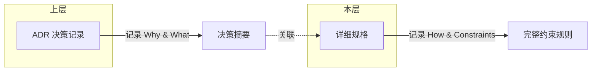

# 规格文档索引

> 详细规格文档，按子域组织。每个 spec 关联一篇 ADR，记录完整的实现约束规则。

## 子域 → 规格映射

| 子域 | 规格数 | 说明 |
|------|--------|------|
| [ingest](./ingest/) | 1 | 文档摄取、版本管理、读取边界 |
| [auth](./auth/) | 0 | 认证授权、RBAC 细粒度权限 |
| [knowledge](./knowledge/) | 0 | 知识库索引、分块策略、检索配置 |
| [qa](./qa/) | 0 | 问答管线、提示词模板、上下文窗口 |

## 完整规格列表

| 规格 | ADR | 子域 | 状态 | 日期 |
|------|-----|------|------|------|
| [文档版本读取边界规格](./ingest/document-version-read-boundary-spec.md) | [ADR-0006](../adr/ADR-0006-document-version-read-boundary.md) | ingest | Accepted | 2026-05-13 |

## 规格与 ADR 的关系

每个 ADR 的受影响行记录高层的决策理由和影响范围；对应的 spec 记录实现时必须遵守的完整约束、API 设计细节、权限边界、错误处理规则和测试验收要求。

## 编写规范

- 每个 spec 文件只对应一个 ADR
- 文件名：`{topic-kebab-case}.md`，放在对应子域目录下
- 规格行文使用规则体（编号条款），便于代码审阅时逐条引用
- 最新文件使用一级标题 `# 标题` 开头，首行引用关联 ADR

---

_最后更新: 2026-06-15_
